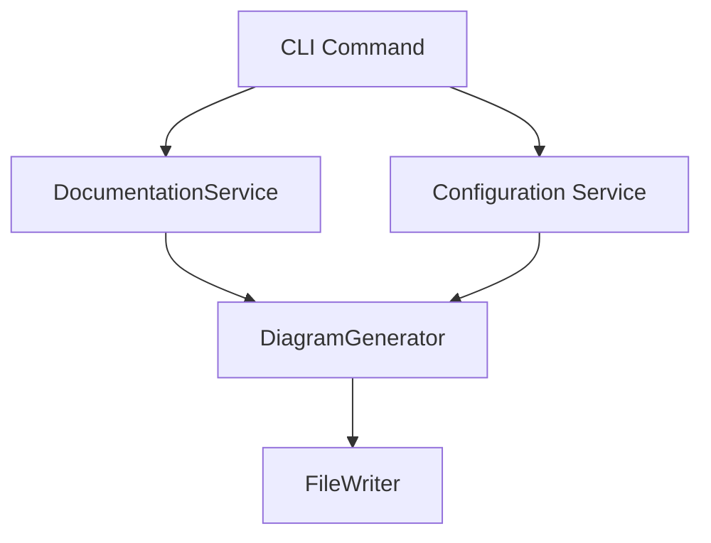
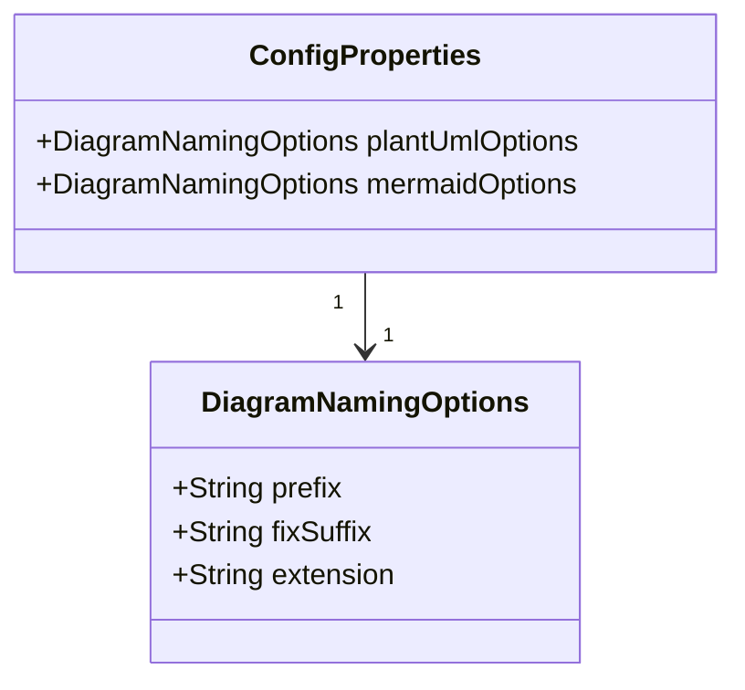

# Product Requirements Document: Configurable Diagram File Naming

**Objective:**
Enable users to customize the naming convention (prefix, suffix, extension) for generated PlantUML and Mermaid diagram files, improving compatibility, organization, and workflow integration.

## Acceptance Criteria

- Users can specify file prefix, suffix, and extension for both Mermaid Markdown and PlantUML diagrams via JSON config.
- Prefixes and suffixes are optional; if provided, each must be less than 20 characters.
- File extensions must be less than 10 characters.
- File names must use only valid UTF-8 characters: [0-9a-zA-Z- ()+._].
- Different naming conventions can be set for Mermaid and PlantUML diagrams.
- If an invalid prefix/suffix is provided, it is ignored and the operation continues.
- If an invalid extension is provided, default to `mmd` for Mermaid and `plantuml` for PlantUML.
- All errors are logged to an error log (path specified in config, default `errors.log`).
- All successful diagram generations are logged to an output log (path specified in config, default `out.log`).

## Example Config JSON

```json
{
  "diagram": {
    "plantuml": {
      "prefix": "2025-API-",
      "suffix": "_v2",
      "extension": "uml"
    },
    "mermaid": {
      "prefix": "arch-",
      "suffix": "",
      "extension": "md"
    },
    "errorLog": "errors.log",
    "outputLog": "out.log"
  }
}
```

## Requirements

- CLI options and config file support for:
  - Diagram file prefix
  - Diagram file fix suffix
  - Diagram file extension (separately for PlantUML and Mermaid)
- Backward compatibility: default naming if options not specified
- Validation of user input (allowed characters, extension format)
- Documentation and usage examples (see Documentation Requirements below)
- Unit and integration tests for new config and CLI options

## Documentation Requirements

**Modular Documentation Structure** (maintain 300-500 lines per file):

- **README.md** (main hub, ~345 lines):

  - Add brief "Configurable Diagram Naming" section (5-7 lines) summarizing the feature
  - Include link to full guide in docs/DIAGRAMS_GUIDE.md
  - Example: "Generate diagrams with custom prefixes, suffixes, and extensions. [Learn more →](docs/DIAGRAMS_GUIDE.md#file-naming-customization)"

- **docs/DIAGRAMS_GUIDE.md** (currently ~599 lines):

  - Add "File Naming Customization" section (~50-80 lines) covering:
    - Overview of naming options, use cases, and benefits
    - Complete configuration JSON example with all fields
    - CLI flag examples for each naming option
    - Validation rules (allowed UTF-8 characters, length limits, extension defaults)
    - Logging behavior (errorLog and outputLog paths)
    - Examples: "2025-API-UserService_v2.uml", "arch-DataFlow.md"
  - Note: Monitor line count after adding; if exceeding 600, consider moving advanced examples to separate file

- **docs/CONFIGURATION.md** (currently ~411 lines):

  - Add "Diagram File Naming" subsection (~40-50 lines) with:
    - Configuration property structure (plantUml.prefix/suffix/extension, mermaid.prefix/suffix/extension)
    - Allowed characters and constraints ([0-9a-zA-Z- ()+._], max lengths)
    - Default values if not specified
    - Error handling (invalid input ignored, defaults applied)
  - Note: Monitor line count after adding; if exceeding 500, consolidate examples with DIAGRAMS_GUIDE.md

- **No new documentation files**: All updates fit within existing modular structure
- **All existing files remain unchanged** in scope/structure except for additions noted above

## Technical Considerations

### System Architecture Overview



- CLI parses new options and passes to config/service layer
- ConfigurationService merges CLI and config file values
- DiagramGenerator uses naming options to generate file names
- FileWriter saves diagrams with correct names

### Technology Stack

- Java 21, Spring Boot 3.x
- Spring Shell for CLI
- Jackson for config file parsing
- JUnit/Mockito for testing

### Integration Points

- CLI: new options/flags
- ConfigurationService: new config properties
- DiagramGenerator: file naming logic
- DocumentationService: passes naming options

### Deployment Architecture

- No change to JAR/Docker structure
- Ensure config files are mounted/accessible in Docker

### Scalability

- No impact; naming logic is lightweight

## Data Model Design



- Add `DiagramNamingOptions` to config model
- Validate fields (non-null, allowed chars, extension format)

## Service Layer Design

- Update `ConfigurationService` to load new options from CLI/config
- Update `DiagramGenerator` to accept naming options
- Error handling for invalid naming options
- Logging for file naming decisions

## CLI Design

- Add options:
  - `--plantuml-prefix`, `--plantuml-suffix`, `--plantuml-ext`
  - `--mermaid-prefix`, `--mermaid-suffix`, `--mermaid-ext`
- Validate and show errors for invalid values
- Show effective naming in status/feedback

## Configuration Management

- Add new properties to config JSON/YAML:
  - `diagram.plantuml.prefix`, `diagram.plantuml.suffix`, `diagram.plantuml.extension`
  - `diagram.mermaid.prefix`, `diagram.mermaid.suffix`, `diagram.mermaid.extension`
- Support CLI override
- Validate config at startup

## Testing Strategy

- Unit tests for config parsing, CLI option parsing, naming logic
- Integration tests: end-to-end diagram generation with custom names
- Negative tests: invalid input, missing values
- Performance: ensure no regression

## Security & Performance

- Input validation to prevent path traversal, invalid extensions
- No sensitive data in file names
- No performance impact

## Code Review Checklist

- [ ] Service interfaces updated for naming options
- [ ] DI for config/CLI values
- [ ] Config parsing and validation
- [ ] Exception handling for invalid input
- [ ] Logging of naming logic
- [ ] CLI UX: clear error messages, help text
- [ ] Test coverage for all new logic
- [ ] API error handling
- [ ] Documentation updated
- [ ] Checkstyle/Gradle config updated if needed

## Context Template

- **Feature PRD:** Configurable diagram file naming
- **Current Architecture:** CLI-driven Spring Boot app, config file support, diagram generation services
- **Related Features:** Existing diagram generation, config management
- **Dependencies:** Spring Shell, Jackson, JUnit
