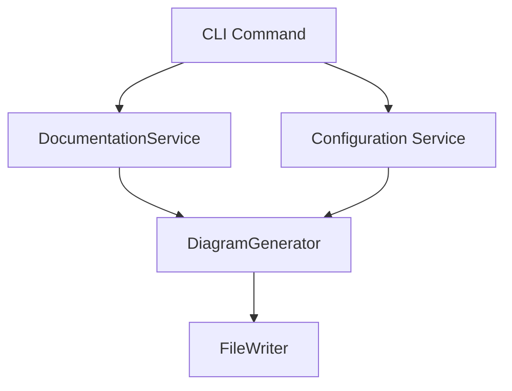
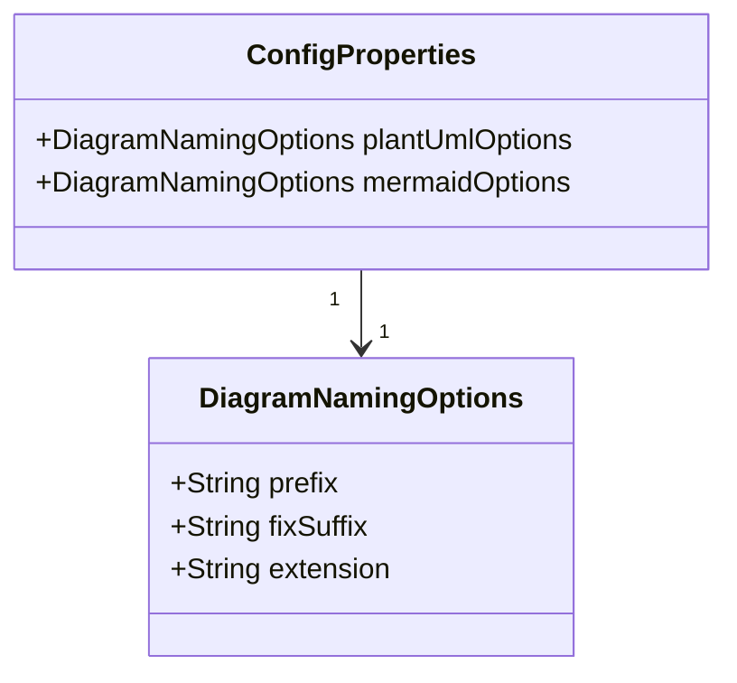

# Implementation Plan: Configurable Diagram File Naming

## Goal

Enable users to customize the naming convention for generated diagram files (PlantUML and Mermaid) by specifying:

- File prefix (e.g., "arch*", "diagram*")
- Fix suffix (e.g., "\_fixed", "\_v2")
- File extension (e.g., ".puml", ".md")
  This improves integration with external tools, versioning, and workflow automation.

## Requirements

- CLI options and config file support for:
  - Diagram file prefix
  - Diagram file fix suffix
  - Diagram file extension (separately for PlantUML and Mermaid)
- Backward compatibility: default naming if options not specified
- Validation of user input (allowed characters, extension format)
- Documentation and usage examples
- Unit and integration tests for new config and CLI options

## Technical Considerations

### System Architecture Overview

- CLI parses new options and passes to config/service layer
- ConfigurationService merges CLI and config file values
- DiagramGenerator uses naming options to generate file names
- FileWriter saves diagrams with correct names

### Technology Stack

- Java 21, Spring Boot 3.x
- Spring Shell for CLI
- Jackson for config file parsing
- JUnit/Mockito for testing

### Integration Points

- CLI: new options/flags
- ConfigurationService: new config properties
- DiagramGenerator: file naming logic
- DocumentationService: passes naming options

### Deployment Architecture

- No change to JAR/Docker structure
- Ensure config files are mounted/accessible in Docker

### Scalability

- No impact; naming logic is lightweight

## Data Model Design

- Add `DiagramNamingOptions` to config model
- Validate fields (non-null, allowed chars, extension format)

## Service Layer Design

- Update `ConfigurationService` to load new options from CLI/config
- Update `DiagramGenerator` to accept naming options
- Error handling for invalid naming options
- Logging for file naming decisions

## CLI Design

- Add options:
  - `--plantuml-prefix`, `--plantuml-suffix`, `--plantuml-ext`
  - `--mermaid-prefix`, `--mermaid-suffix`, `--mermaid-ext`
- Validate and show errors for invalid values
- Show effective naming in status/feedback

## Configuration Management

- Add new properties to config JSON/YAML:
  - `diagram.plantuml.prefix`, `diagram.plantuml.suffix`, `diagram.plantuml.extension`
  - `diagram.mermaid.prefix`, `diagram.mermaid.suffix`, `diagram.mermaid.extension`
- Support CLI override
- Validate config at startup

## Testing Strategy

- Unit tests for config parsing, CLI option parsing, naming logic
- Integration tests: end-to-end diagram generation with custom names
- Negative tests: invalid input, missing values
- Performance: ensure no regression

## Security & Performance

- Input validation to prevent path traversal, invalid extensions
- No sensitive data in file names
- No performance impact

## Code Review Checklist

- [ ] Service interfaces updated for naming options
- [ ] DI for config/CLI values
- [ ] Config parsing and validation
- [ ] Exception handling for invalid input
- [ ] Logging of naming logic
- [ ] CLI UX: clear error messages, help text
- [ ] Test coverage for all new logic
- [ ] API error handling
- [ ] Documentation updated
- [ ] Checkstyle/Gradle config updated if needed

## Context Template

- **Feature PRD:** Configurable diagram file naming
- **Current Architecture:** CLI-driven Spring Boot app, config file support, diagram generation services
- **Related Features:** Existing diagram generation, config management
- **Dependencies:** Spring Shell, Jackson, JUnit
