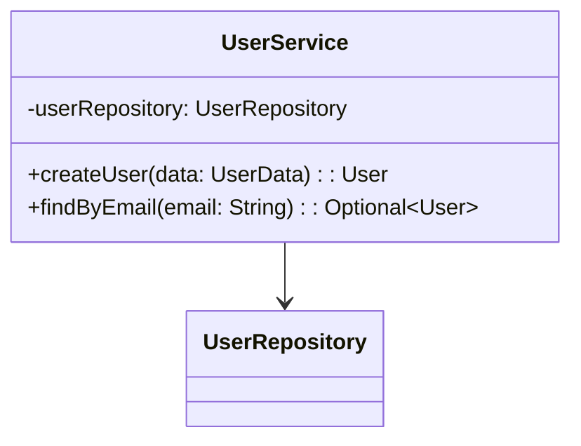
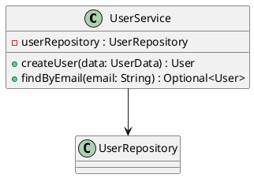

# 📚 Documentor - AI-Powered Code Documentation Generator

A powerful Java Spring Boot command-line application that analyzes Java and Python projects to generate comprehensive documentation using Large Language Models (LLMs).

> 🚨 **IMPORTANT**: Use the enhanced version (`run-enhanced.cmd`) for better error handling, especially for unit test generation. This version includes critical fixes for NullPointerException issues and improved thread safety.

## ⭐ Key Features

- **🔍 Multi-Language Analysis**: Java and Python with comprehensive AST parsing
- **🤖 AI-Powered Documentation**: OpenAI, Anthropic Claude, Ollama, and other LLM integrations
- **📝 Comprehensive Output**: Markdown documentation with examples and usage instructions
- **🎨 Mermaid Diagrams**: Modern class diagrams rendered in GitHub and markdown
- **🌿 PlantUML Diagrams**: Professional UML class diagrams with advanced relationships
- **🏷️ Configurable Diagram Naming**: Custom prefixes, suffixes, and extensions for diagram files [Learn more →](docs/DIAGRAMS_GUIDE.md#file-naming-customization)
- **🧪 Unit Test Generation**: Creates test suggestions targeting 90% code coverage
- **⚡ Multi-Threading**: Parallel processing for optimal performance
- **🔧 Pre-commit Hooks**: Automated quality assurance
- **✅ High Test Coverage**: 96%+ code coverage
- **🏗️ Production Ready**: Spring Boot 3.5.6 with Java 17 LTS

## 🚀 Quick Start (5 Minutes)

### 1. Clone and Build

```bash
git clone https://github.com/pbaletkeman/documentor.git
cd documentor
./gradlew build
```

### 2. Start with Ollama (Recommended)

```bash
# Install and start Ollama
ollama serve

# In another terminal, pull a model
ollama pull llama3.2

# Configure Documentor
cp samples/config-ollama.json config.json

# Start Documentor
./gradlew runApp
```

### 3. Run Your First Analysis

In the interactive shell:

```bash
analyze --project-path ./src --generate-mermaid true --config config.json
```

**Done!** Find your documentation in `./docs` and diagrams in `./diagrams`

## 📖 Documentation

### Getting Started

- **[Getting Started Guide](docs/GETTING_STARTED.md)** - Installation and first steps
- **[Quick Start](docs/GETTING_STARTED.md#your-first-analysis)** - Fastest way to get running

### Configuration & Setup

- **[Configuration Guide](docs/CONFIGURATION.md)** - All configuration options explained
- **[LLM Integrations](docs/LLM_INTEGRATIONS.md)** - Setup for OpenAI, Ollama, llama.cpp

### Usage & Workflows

- **[Usage Examples](docs/USAGE_EXAMPLES.md)** - Command examples and practical workflows
- **[Class Diagrams Guide](docs/DIAGRAMS_GUIDE.md)** - Mermaid and PlantUML diagram guide

### Additional Resources

- **[Enhanced Version Instructions](docs/ENHANCED-README.md)** - Advanced features and improvements
- **[Configuration Overview](docs/CONFIGURATION_OVERVIEW.md)** - Deep dive into configuration system
- **[Project Organization](docs/ORGANIZATION_SUMMARY.md)** - Project structure and architecture

## 🛠️ Requirements

- **Java 17** (LTS) or higher
- **Gradle 9.1.0** or higher
- **Git** (optional, for pre-commit hooks)

## 🌿 Branch Information

| Branch | Java Version | Description |
|--------|-------------|-------------|
| `main` | Java 21 | Latest features including Virtual Threads, Pattern Matching, Sequenced Collections |
| `java-17-lts` | Java 17 | Long-term support branch with traditional Java syntax |

## 📦 Release Workflows

The project includes GitHub Actions workflows for creating releases:

| Workflow | Java Version | Trigger | Artifact |
|----------|-------------|---------|----------|
| `release-java17.yml` | Java 17 LTS | Tag `v*.*.*-java17` or manual | `documentor-java17.jar` |
| `release-java21.yml` | Java 21 | Tag `v*.*.*-java21` or manual | `documentor-java21.jar` |

To create a release:
```bash
# Java 17 LTS release
git tag v1.2.0-java17
git push origin v1.2.0-java17

# Java 21 release
git tag v1.2.0-java21
git push origin v1.2.0-java21
```

## 🎯 Common Use Cases

### Local Development with Ollama

```bash
cp samples/config-ollama.json config.json
./gradlew runApp
# analyze --project-path ./src --generate-mermaid true --config config.json
```

### Production with OpenAI

```bash
cp samples/config-openai.json config.json
# Add your API key to config.json
./gradlew runApp
# analyze --project-path ./src --config config.json
```

### Diagrams Only (Fast)

```bash
./gradlew runApp
# analyze --project-path ./src --config samples/config-diagrams-only.json
```

### Documentation Only (Comprehensive)

```bash
./gradlew runApp
# analyze --project-path ./src --config samples/config-docs-only.json
```

## 💻 CLI Commands

### Analyze and Generate Documentation

```bash
analyze --project-path /path/to/project --config config.json

# With diagrams
analyze --project-path ./src --generate-mermaid true --config config.json

# With both diagram types
analyze --project-path ./src --generate-mermaid true --generate-plantuml true --config config.json
```

### Scan Project (Analysis Only)

```bash
scan --project-path /path/to/project
```

### Check Status

```bash
status
```

### Validate Configuration

```bash
validate-config --config config.json
```

### Show Help

```bash
help
quick-start
info
```

## 🧠 Supported Languages

- ☕ **Java** (.java) - Full AST parsing with JavaParser
- 🐍 **Python** (.py) - AST parsing with regex fallback

## 🤖 Supported LLM Providers

| Provider  | Model Examples       | Cost | Privacy | Setup |
| --------- | -------------------- | ---- | ------- | ----- |
| OpenAI    | gpt-3.5-turbo, gpt-4 | Paid | Cloud   | Easy  |
| Ollama    | llama3.2, codellama  | Free | Local   | Easy  |
| llama.cpp | CodeLlama, Llama-2   | Free | Local   | Hard  |
| Anthropic | Claude 3             | Paid | Cloud   | Easy  |

**See [LLM Integrations](docs/LLM_INTEGRATIONS.md) for detailed setup instructions.**

## 📊 Output Examples

### Generated Documentation

- Main project README with statistics
- Individual documentation for each class/function
- Method signatures and parameter documentation
- Usage examples and best practices
- Unit test recommendations

### Mermaid Diagrams



### PlantUML Diagrams



## 🧪 Quality Assurance

- ✅ **96%+ Code Coverage** (exceeds 95% minimum)
- ✅ **Checkstyle Enforcement** (Google Java Style Guide)
- ✅ **Pre-commit Hooks** for automated quality checks
- ✅ **Comprehensive Test Suite** covering all modules
- ✅ **JaCoCo Coverage Verification** in build pipeline

## 🔧 Configuration

Documentor is highly configurable with external JSON files. Pre-configured templates available:

| Template                        | Purpose                    |
| ------------------------------- | -------------------------- |
| `config-ollama.json`            | Local LLM with Ollama      |
| `config-openai.json`            | OpenAI/ChatGPT integration |
| `config-llamacpp.json`          | llama.cpp server           |
| `config-diagrams-only.json`     | Diagrams only              |
| `config-docs-only.json`         | Documentation only         |
| `config-unit-test-logging.json` | Unit test logging          |

**See [Configuration Guide](docs/CONFIGURATION.md) for all options.**

## 📈 Advanced Features

### Parallel Processing

- Multi-threaded analysis with configurable thread pool
- Efficient resource management
- Optimal performance scaling

### Private Member Analysis

- Option to include/exclude private fields and methods
- Complete implementation details or public API only
- Controlled via CLI or configuration

### Flexible Output

- Mermaid and/or PlantUML diagrams
- Comprehensive documentation or diagrams-only
- Customizable output directories
- Configurable icon inclusion

### Unit Test Generation

- Generate test suggestions targeting 90% coverage
- Log test commands without running
- Run tests automatically if desired

## 🔍 Project Analysis

### Java Analysis Detects

- Classes, interfaces, enums
- Methods with parameters and return types
- Fields and constants
- Javadoc and annotations
- Visibility modifiers
- Inheritance and implementation

### Python Analysis Detects

- Classes and inheritance
- Functions and methods
- Module-level variables
- Docstrings and decorators
- Private members (underscore convention)

## 📞 Support

- 📧 **Email**: `documentor@letkeman.ca`
- 🐛 **Issues**: [GitHub Issues](https://github.com/pbaletkeman/documentor/issues)
- 💬 **Discussions**: [GitHub Discussions](https://github.com/pbaletkeman/documentor/discussions)
- 📖 **Documentation**: See links in Documentation section above

## 🤝 Contributing

Contributions welcome! Please follow these steps:

1. Fork the repository
2. Create a feature branch
3. Write tests for your changes
4. Run `./gradlew check` to verify code quality
5. Submit a Pull Request

**Code Standards:**

- Maintain 95%+ test coverage
- Follow Google Java Style Guide
- Add comprehensive JavaDoc comments

## 📄 License

MIT License - see [LICENSE](LICENSE) file for details

Copyright (c) 2025 Pete Letkeman

## 🙏 Acknowledgments

- **JavaParser** - Java AST parsing
- **Spring Boot** - Application framework
- **Spring Shell** - CLI interface
- **Mermaid** - Diagram rendering
- **PlantUML** - UML diagrams
- **OpenAI, Anthropic, Ollama** - LLM providers
- **Gradle** - Build automation

## ✅ Status

- **Build**: ✅ Passing
- **Coverage**: ✅ 96%+ (exceeds 95% requirement)
- **Tests**: ✅ All passing
- **Dependencies**: ✅ Up-to-date
- **Production Ready**: ✅ Yes

---

## 📚 Full Documentation Index

| Document                                                 | Purpose                            |
| -------------------------------------------------------- | ---------------------------------- |
| [Getting Started](docs/GETTING_STARTED.md)               | Installation and first steps       |
| [Configuration](docs/CONFIGURATION.md)                   | All configuration options          |
| [LLM Integrations](docs/LLM_INTEGRATIONS.md)             | Setup for each LLM provider        |
| [Usage Examples](docs/USAGE_EXAMPLES.md)                 | Command examples and workflows     |
| [Diagrams Guide](docs/DIAGRAMS_GUIDE.md)                 | Mermaid and PlantUML guide         |
| [Enhanced Version](docs/ENHANCED-README.md)              | Advanced features                  |
| [Configuration Detailed](docs/CONFIGURATION_OVERVIEW.md) | Deep dive into configuration       |
| [Project Organization](docs/ORGANIZATION_SUMMARY.md)     | Project structure and architecture |

---

**Made with ❤️ and 🤖 AI assistance**

> "Good documentation is like a love letter to your future self and your teammates." - Anonymous Developer
