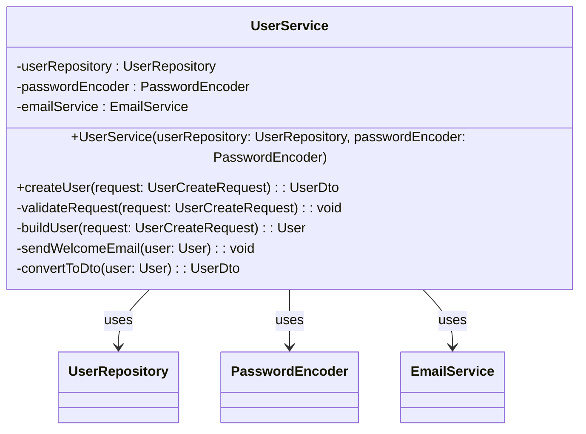
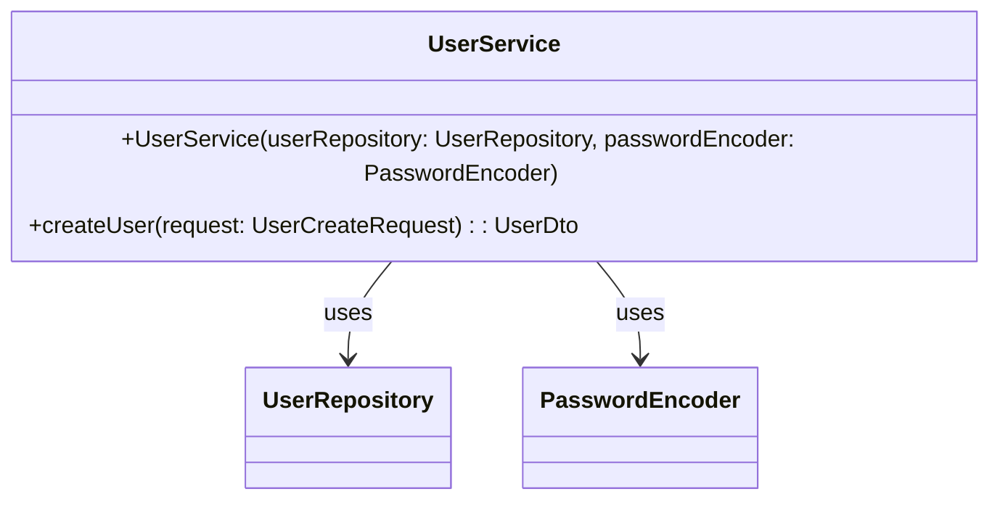
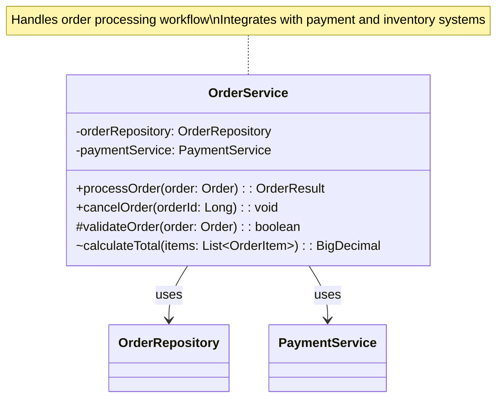

# 📚 Documentor - AI-Powered Code Documentation Generator

A powerful Java Spring Boot Command Line application that analyzes Java and Python projects to generate comprehensive documentation using Large Language Models (LLMs).

## 🚀 Features

- **🔍 Multi-Language Analysis**: Supports Java and Python codebases with comprehensive AST parsing
- **🤖 AI-Powered Documentation**: Integrates with OpenAI GPT, Anthropic Claude, and other LLM models
- **📝 Comprehensive Output**: Generates markdown documentation with examples and usage instructions
- **🎨 Mermaid Class Diagrams**: Generate visual class diagrams for non-private classes and methods
- **🌿 PlantUML Class Diagrams**: Generate professional UML diagrams with advanced relationship detection
- **🧪 Unit Test Generation**: Creates unit tests targeting 90% code coverage
- **⚡ Multi-Threading**: Parallel processing for optimal performance with configurable thread pools
- **🔧 Pre-commit Hooks**: Automated quality assurance with Checkstyle and testing
- **📊 Rich Analysis**: Discovers classes, methods, variables, and documentation
- **🎯 Configurable**: External JSON configuration for LLM models and settings
- **📋 Status Monitoring**: Real-time project and configuration status display
- **✅ High Test Coverage**: 96%+ code coverage with comprehensive test suites
- **🏗️ Production Ready**: Built with Spring Boot 3.5.6 and Java 21 for enterprise use
- **📦 Fat JAR Support**: Create self-contained executable JARs for easy distribution

## 📋 Table of Contents

- [Requirements](#-requirements)
- [Installation](#-installation)
- [Quick Start](#-quick-start)
- [Configuration](#-configuration)
  - [Configuration Files Overview](#configuration-files-overview)
  - [Configuration Options Explained](#configuration-options-explained)
  - [LLM Models Configuration](#llm-models-configuration)
  - [Output Settings Configuration](#output-settings-configuration)
  - [Analysis Settings Configuration](#analysis-settings-configuration)
  - [API Key Configuration](#-api-key-configuration)
- [LLM Integrations](#llm-integrations)
  - [llama.cpp Integration](#-llamacpp-integration)
  - [Ollama Integration](#-ollama-integration)
  - [OpenAI/ChatGPT Integration](#-openaichatgpt-integration)
  - [Diagrams Only Configuration](#-diagrams-only-configuration)
  - [Documentation Only Configuration](#-documentation-only-configuration)
  - [Unit Test Logging Configuration](#-unit-test-logging-configuration)
- [Usage & Examples](#-usage--examples)
- [Development](#development)
- [Testing](#testing)
- [Contributing](#contributing)
- [License](#license)

## 🛠️ Requirements

- **Java 21** or higher
- **Gradle 9.1.0** or higher
- **Git** (for pre-commit hooks)

## ✨ Optional

- **llama.cpp** instructions provided
- **Ollama** instructions provided
- **LLM API Keys** (OpenAI, Anthropic, etc.)

### Supported Languages for Analysis

- ☕ **Java** (.java files) - Full AST parsing with JavaParser
- 🐍 **Python** (.py files) - AST parsing with fallback to regex

## 📦 Installation

### 1. Clone the Repository

```bash
git clone https://github.com/pbaletkeman/documentor.git
cd documentor
```

### 2. Set Up Pre-commit Hooks (Optional but Recommended)

```bash
# For Unix/Linux/macOS
cp .githooks/pre-commit .git/hooks/pre-commit
chmod +x .git/hooks/pre-commit

# For Windows
copy .githooks\\pre-commit.bat .git\\hooks\\pre-commit.bat
```

### 3. Build the Project

```bash
# Unix/Linux/macOS
./gradlew build

# Windows
gradlew.bat build
```

### 4. Create Distribution JARs

```bash
# Create Spring Boot executable JAR (recommended)
./gradlew bootJar

# Create fat JAR with all dependencies
./gradlew fatJar

# Both JARs will be in build/libs/
```

### 5. Display Help

```bash
# Show help without running the application
gradlew.bat helpInfo

# Show detailed command help
gradlew.bat runApp -Pargs="help"

# List all available Gradle tasks
gradlew.bat tasks
```

## 🚀 Quick Start

Get up and running with Ollama in 5 minutes!

### Option 1: Using Ollama (Recommended for Local Development)

1. **Install Ollama**:

   ```bash
   # Visit https://ollama.ai and download for your OS
   # Or use package managers:

   # macOS
   brew install ollama

   # Linux
   curl -fsSL https://ollama.ai/install.sh | sh
   ```

2. **Start Ollama and pull a model**:

   ```bash
   ollama serve
   ollama pull llama3.2  # Or codellama for coding tasks
   ```

3. **Use the provided Ollama config**:

   ```bash
   cp config-ollama.json config.json
   ```

4. **Run the application**:

   ```bash
   ./gradlew runApp
   ```

5. **Analyze your first project**:

   ```bash
   analyze --project-path ./src --generate-mermaid true
   ```

### Option 2: Using OpenAI/Other APIs

1. **Copy the pre-configured OpenAI config**:

   ```bash
   cp config-openai.json config.json
   ```

2. **Add your API key to config.json**:

   ```json
   {
     "llm_models": [
       {
         "name": "gpt-3.5-turbo",
         "api_key": "your-actual-api-key-here",
         "endpoint": "https://api.openai.com/v1/chat/completions"
       }
     ]
   }
   ```

3. **Run the application**:

   ```bash
   ./gradlew runApp
   ```

## ⚙️ Configuration

### Configuration Files Overview

Documentor provides several pre-configured settings files for different use cases:

| Configuration File              | Purpose               | Description                                                                 |
| ------------------------------- | --------------------- | --------------------------------------------------------------------------- |
| `config.json`                   | Main Configuration    | Your active configuration file - copy one of the templates to this filename |
| `config-openai.json`            | OpenAI/ChatGPT        | Quickstart configuration for using OpenAI API services                      |
| `config-ollama.json`            | Ollama Integration    | Optimized configuration for local Ollama models                             |
| `config-llamacpp.json`          | llama.cpp Integration | Settings for using local llama.cpp server                                   |
| `config-unit-test-logging.json` | Unit Test Logging     | Minimal configuration focused on unit test command logging                  |
| `config-diagrams-only.json`     | Diagrams Only         | Configuration focused only on generating diagrams (no documentation)        |
| `config-docs-only.json`         | Documentation Only    | Configuration for generating only documentation (no diagrams)               |

### Configuration Options Explained

The configuration file is divided into three main sections:

1. **llm_models**: LLM model configuration and API settings
2. **output_settings**: Documentation generation preferences and output formats
3. **analysis_settings**: Code analysis behavior and filtering options

### LLM Models Configuration

The `llm_models` section defines the LLM providers you want to use:

```json
"llm_models": [
  {
    "name": "model-name",         // Model name (gpt-3.5-turbo, llama3.2, codellama, etc.)
    "api_key": "your-api-key",    // API key (only for services requiring authentication)
    "endpoint": "api-endpoint",   // API endpoint URL
    "max_tokens": 4096,           // Maximum tokens per response
    "temperature": 0.7,           // Response randomness (0.0-1.0)
    "timeout_seconds": 30,        // Request timeout in seconds
    "additional_config": {}       // Optional provider-specific settings
  }
]
```

| Option              | Description                                               | Default                        |
| ------------------- | --------------------------------------------------------- | ------------------------------ |
| `name`              | Model identifier (for OpenAI: gpt-3.5-turbo, gpt-4, etc.) | Required                       |
| `api_key`           | Authentication key for the LLM service                    | Required for OpenAI, Anthropic |
| `endpoint`          | API endpoint URL                                          | Service-specific               |
| `max_tokens`        | Maximum tokens in response                                | 4096                           |
| `temperature`       | Response creativity/randomness (0.0-1.0)                  | 0.7                            |
| `timeout_seconds`   | Request timeout in seconds                                | 30                             |
| `additional_config` | Provider-specific parameters                              | {}                             |

### Output Settings Configuration

The `output_settings` section controls documentation generation:

```json
"output_settings": {
  "output_directory": "./docs",         // Output directory for documentation
  "format": "markdown",                 // Output format (currently only markdown)
  "include_icons": true,                // Include emoji icons in output
  "generate_unit_tests": true,          // Generate unit tests
  "run_unit_test_commands": false,      // Run generated test commands automatically
  "log_unit_test_commands": true,       // Log test commands to file
  "target_coverage": 0.9,               // Target test coverage (0.0-1.0)
  "generate_mermaid": true,             // Generate Mermaid diagrams
  "mermaid_output_path": "./diagrams",  // Mermaid diagrams output path
  "generate_plantuml": true,            // Generate PlantUML diagrams
  "plantuml_output_path": "./uml"       // PlantUML diagrams output path
}
```

| Option                   | Description                                           | Default          |
| ------------------------ | ----------------------------------------------------- | ---------------- |
| `output_directory`       | Directory where documentation files will be generated | `./docs`         |
| `format`                 | Output format (currently only supports markdown)      | `markdown`       |
| `include_icons`          | Include emoji icons in documentation                  | `true`           |
| `generate_unit_tests`    | Generate unit tests for classes                       | `true`           |
| `run_unit_test_commands` | Automatically run generated test commands             | `false`          |
| `log_unit_test_commands` | Log test commands to a file for review                | `true`           |
| `target_coverage`        | Target test coverage percentage (0.0-1.0)             | `0.9`            |
| `generate_mermaid`       | Generate Mermaid class diagrams                       | `true`           |
| `mermaid_output_path`    | Directory for Mermaid diagram output                  | `./diagrams`     |
| `generate_plantuml`      | Generate PlantUML class diagrams                      | `false`          |
| `plantuml_output_path`   | Directory for PlantUML diagram output                 | `./uml-diagrams` |
| `verbose_output`         | Include more detailed information in logs             | `false`          |

### Analysis Settings Configuration

The `analysis_settings` section controls code parsing behavior:

```json
"analysis_settings": {
  "include_private_members": false,    // Include private fields/methods
  "max_threads": 4,                    // Maximum threads for parallel processing
  "supported_languages": [             // Languages to analyze
    "java",
    "python"
  ],
  "exclude_patterns": [                // Patterns to exclude from analysis
    "**/test/**",
    "**/target/**",
    "**/build/**"
  ]
}
```

| Option                    | Description                                       | Default              |
| ------------------------- | ------------------------------------------------- | -------------------- |
| `include_private_members` | Include private fields and methods                | `false`              |
| `max_threads`             | Maximum number of threads for parallel processing | `4`                  |
| `supported_languages`     | Languages to analyze                              | `["java", "python"]` |
| `exclude_patterns`        | Glob patterns for files to exclude                | Common build folders |

Create a `config.json` file in the project root with your LLM configurations:

```json
{
  "llm_models": [
    {
      "name": "gpt-3.5-turbo",
      "api_key": "your-openai-api-key-here",
      "endpoint": "https://api.openai.com/v1/chat/completions",
      "max_tokens": 4096,
      "temperature": 0.7,
      "timeout_seconds": 30
    },
    {
      "name": "gpt-4",
      "api_key": "your-openai-api-key-here",
      "endpoint": "https://api.openai.com/v1/chat/completions",
      "max_tokens": 8192,
      "temperature": 0.5,
      "timeout_seconds": 60
    }
  ],
  "output_settings": {
    "output_path": "./docs",
    "format": "markdown",
    "include_icons": true,
    "generate_unit_tests": true,
    "target_coverage": 0.9,
    "generate_mermaid_diagrams": true,
    "mermaid_output_path": "./diagrams",
    "generate_plantuml_diagrams": true,
    "plantuml_output_path": "./plantuml-diagrams"
  },
  "analysis_settings": {
    "include_private_members": true,
    "max_threads": 4,
    "supported_languages": ["java", "python"],
    "exclude_patterns": [
      "**/test/**",
      "**/target/**",
      "**/__pycache__/**",
      "**/node_modules/**",
      "**/.git/**"
    ]
  }
}
```

### 🔑 API Key Configuration

You can provide API keys in several ways:

1. **Direct in config.json** (not recommended for production)
2. **Environment variables**:
   ```bash
   export LLM_API_KEY=your-api-key-here
   ```
3. **System properties**:
   ```bash
   java -DLLM_API_KEY=your-api-key-here -jar documentor.jar
   ```

## LLM Integrations

### 🤖 OpenAI/ChatGPT Integration

Documentor provides seamless integration with OpenAI's GPT models for high-quality documentation generation.

> **Why choose OpenAI/ChatGPT?**
>
> - **Superior Documentation Quality**: Generally produces higher quality, more nuanced documentation
> - **Comprehensive Understanding**: Better comprehension of complex code patterns and intentions
> - **No Local Hardware Requirements**: No need for high-end GPU or significant RAM
> - **Best For**: Production-grade documentation that requires exceptional quality
> - **Use When**: Documentation quality is more important than privacy or cost concerns

#### 🚀 Quick Setup

1. **Get your API key**:

   - Sign up at [OpenAI Platform](https://platform.openai.com/)
   - Create an API key in your account dashboard

2. **Use the pre-configured OpenAI setup**:

   ```bash
   # Copy the ready-to-use OpenAI configuration
   cp config-openai.json config.json

   # Edit config.json and add your API key
   # Replace "YOUR_OPENAI_API_KEY" with your actual key
   ```

3. **Start the application**:

   ```bash
   ./gradlew runApp
   ```

#### 📋 Complete OpenAI Configuration

The `config-openai.json` includes optimal settings for OpenAI integration:

```json
{
  "llm_models": [
    {
      "name": "gpt-3.5-turbo",
      "api_key": "YOUR_OPENAI_API_KEY",
      "endpoint": "https://api.openai.com/v1/chat/completions",
      "max_tokens": 4096,
      "temperature": 0.7,
      "timeout_seconds": 30
    }
  ],
  "output_settings": {
    "output_directory": "./docs",
    "format": "markdown",
    "include_icons": true,
    "generate_unit_tests": true,
    "generate_mermaid": true,
    "verbose_output": false
  },
  "analysis_settings": {
    "include_private_members": false,
    "max_threads": 4,
    "supported_languages": ["java", "python"],
    "exclude_patterns": ["**/test/**", "**/target/**", "**/build/**"]
  }
}
```

### 🦙 llama.cpp Integration

Documentor supports **llama.cpp** for flexible local LLM model integration! Run your preferred models with a lightweight server implementation that keeps your data private and has no API costs.

> **Why choose llama.cpp?**
>
> - **Maximum Control & Flexibility**: Direct access to model parameters and server configuration
> - **Lower Resource Usage**: More efficient memory utilization compared to Ollama
> - **More Model Customization**: Support for fine-tuned quantization levels (Q4_K_M, Q5_K_M, etc.)
> - **Best For**: Technical users who need precise control over model parameters and server settings
> - **Use When**: You need the most efficient resource usage or specific quantization options

#### 🚀 Quick Setup

##### Step 1: Download Ready-to-Use Binaries

1. **Download the pre-built llama.cpp binaries** for your platform:

   - **Windows**: Download the latest Windows ZIP (`llama-<version>-bin-win.zip`) from the [official releases page](https://github.com/ggerganov/llama.cpp/releases)
   - **macOS**: Download the macOS package (`llama-<version>-bin-darwin.tar.gz`)
   - **Linux**: Download the Linux package (`llama-<version>-bin-linux.tar.gz`)

2. **Extract the downloaded package**:

   ```bash
   # Windows (PowerShell)
   Expand-Archive -Path llama-<version>-bin-win.zip -DestinationPath llama-cpp

   # Windows (Command Prompt)
   mkdir llama-cpp
   tar -xf llama-<version>-bin-win.zip -C llama-cpp

   # macOS/Linux
   mkdir -p llama-cpp
   tar -xzf llama-<version>-bin-<platform>.tar.gz -C llama-cpp
   ```

##### Step 2: Get a Compatible Model

1. **Download a GGUF model file** (we recommend CodeLlama for code documentation):

   - Visit [HuggingFace](https://huggingface.co/TheBloke/CodeLlama-7B-GGUF/tree/main) in your browser
   - Download `codellama-7b.Q4_K_M.gguf` (good balance of quality and speed)
   - Or use this command to download directly:

   ```bash
   # Create models directory inside your llama-cpp folder
   mkdir -p llama-cpp/models

   # Download model with curl
   curl -L https://huggingface.co/TheBloke/CodeLlama-7B-GGUF/resolve/main/codellama-7b.Q4_K_M.gguf -o llama-cpp/models/codellama-7b.Q4_K_M.gguf
   ```

##### Step 3: Start the Server

```bash
# Navigate to the llama-cpp directory
cd llama-cpp

# Start the server on the default port (8080)
# For Windows:
server.exe -m models/codellama-7b.Q4_K_M.gguf --host 0.0.0.0 --port 8080

# For macOS/Linux:
./server -m models/codellama-7b.Q4_K_M.gguf --host 0.0.0.0 --port 8080
```

##### Alternative: Using Docker (No Installation Required)

If you prefer using Docker, you can run llama.cpp without installing anything:

```bash
# Step 1: Create a directory for your models
mkdir -p ~/llama-models

# Step 2: Download a model (if you don't have one)
curl -L https://huggingface.co/TheBloke/CodeLlama-7B-GGUF/resolve/main/codellama-7b.Q4_K_M.gguf -o ~/llama-models/codellama-7b.Q4_K_M.gguf

# Step 3: Run the llama.cpp server with Docker
docker run -it --rm -p 8080:8080 -v ~/llama-models:/models \
  ghcr.io/ggerganov/llama.cpp:full \
  -m /models/codellama-7b.Q4_K_M.gguf --host 0.0.0.0 --port 8080
```

For Windows, use one of these commands:

```cmd
# Windows Command Prompt
docker run -it --rm -p 8080:8080 -v "%USERPROFILE%\llama-models:/models" ^
  ghcr.io/ggerganov/llama.cpp:full ^
  -m /models/codellama-7b.Q4_K_M.gguf --host 0.0.0.0 --port 8080
```

```powershell
# Windows PowerShell
docker run -it --rm -p 8080:8080 -v "$env:USERPROFILE\llama-models:/models" `
  ghcr.io/ggerganov/llama.cpp:full `
  -m /models/codellama-7b.Q4_K_M.gguf --host 0.0.0.0 --port 8080
```

#### Using Documentor with llama.cpp

After your llama.cpp server is running, configure Documentor to use it:

```bash
# Copy the ready-to-use llama.cpp configuration
cp config-llamacpp.json config.json

# Start the application
./gradlew runApp
```

#### Running Your First Analysis

With the llama.cpp server running and Documentor configured:

```bash
# In the Documentor shell, run an analysis
analyze --project-path ./src --generate-mermaid true
```

#### 📋 Complete llama.cpp Configuration

The `config-llamacpp.json` includes optimal settings for llama.cpp integration:

```json
{
  "llm_models": [
    {
      "name": "llamacpp",
      "endpoint": "http://localhost:8080/completion",
      "max_tokens": 2048,
      "temperature": 0.5,
      "timeout_seconds": 90
    }
  ],
  "output_settings": {
    "output_directory": "./docs",
    "format": "markdown",
    "include_icons": true,
    "generate_unit_tests": true,
    "run_unit_test_commands": false,
    "log_unit_test_commands": true
  }
}
```

### 🦙 Ollama Integration

Documentor provides **seamless integration with Ollama** for local LLM models! Run AI-powered documentation generation completely offline with no API costs.

> **Why choose Ollama?**
>
> - **Simplicity & Ease of Use**: One-command installation and model management
> - **User-Friendly Interface**: Simple CLI with model discovery and version management
> - **Integrated Model Library**: Easy access to popular models without manual downloads
> - **Best For**: Users who want local AI with minimal setup complexity
> - **Use When**: You need quick setup and convenient model management without deep customization

#### 🚀 Quick Setup

1. **Install Ollama** from [ollama.ai](https://ollama.ai)

   ```bash
   # macOS
   brew install ollama

   # Linux
   curl -fsSL https://ollama.ai/install.sh | sh

   # Windows - Download from ollama.ai
   ```

2. **Start Ollama service**:

   ```bash
   ollama serve
   ```

3. **Pull recommended models**:

   ```bash
   # For general documentation (recommended)
   ollama pull llama3.2

   # For code-specific tasks (best for programming)
   ollama pull codellama

   # Lightweight option
   ollama pull phi3:mini
   ```

4. **Use the pre-configured Ollama setup**:

   ```bash
   # Copy the ready-to-use Ollama configuration
   cp config-ollama.json config.json

   # Start the application
   ./gradlew runApp
   ```

### 📊 Diagrams Only Configuration

For scenarios where you want to generate only diagrams without full documentation:

```bash
# Copy the diagrams-only configuration
cp config-diagrams-only.json config.json
```

#### 📋 Complete Diagrams Only Configuration

The `config-diagrams-only.json` provides optimized settings for diagram generation:

```json
{
  "llm_models": [
    {
      "name": "codellama",
      "endpoint": "http://localhost:11434/api/generate",
      "max_tokens": 2048,
      "temperature": 0.3,
      "timeout_seconds": 45
    }
  ],
  "output_settings": {
    "output_directory": "./diagrams",
    "format": "markdown",
    "include_icons": false,
    "generate_unit_tests": false,
    "generate_mermaid": true,
    "mermaid_output_path": "./diagrams/mermaid",
    "generate_plantuml": true,
    "plantuml_output_path": "./diagrams/plantuml",
    "verbose_output": false
  },
  "analysis_settings": {
    "include_private_members": false,
    "max_threads": 4,
    "supported_languages": ["java", "python"],
    "exclude_patterns": ["**/test/**", "**/target/**", "**/build/**"]
  }
}
```

### 📝 Documentation Only Configuration

For scenarios where you want to generate only textual documentation without diagrams:

```bash
# Copy the documentation-only configuration
cp config-docs-only.json config.json
```

#### 📋 Complete Documentation Only Configuration

The `config-docs-only.json` focuses exclusively on comprehensive documentation:

```json
{
  "llm_models": [
    {
      "name": "llama3.2",
      "endpoint": "http://localhost:11434/api/generate",
      "max_tokens": 4096,
      "temperature": 0.7,
      "timeout_seconds": 60
    }
  ],
  "output_settings": {
    "output_directory": "./docs",
    "format": "markdown",
    "include_icons": true,
    "generate_unit_tests": true,
    "run_unit_test_commands": false,
    "log_unit_test_commands": true,
    "generate_mermaid": false,
    "generate_plantuml": false,
    "verbose_output": true
  },
  "analysis_settings": {
    "include_private_members": true,
    "max_threads": 6,
    "supported_languages": ["java", "python"],
    "exclude_patterns": ["**/test/**", "**/target/**", "**/build/**"]
  }
}
```

### 🧪 Unit Test Command Options

Documentor now supports fine-grained control over unit test commands with two new options:

- **run_unit_test_commands**: When enabled, automatically executes the generated unit test commands
- **log_unit_test_commands**: When enabled, logs the generated commands to a file for later review

#### Configuration Example

```json
{
  "output_settings": {
    "generate_unit_tests": true,
    "run_unit_test_commands": false, // Don't run tests automatically
    "log_unit_test_commands": true, // Log commands to file
    "target_coverage": 0.9
  }
}
```

#### 🚀 Usage Examples

```bash
# Generate unit tests but don't run them (only log)
analyze --project-path ./src --generate-unit-tests true --run-unit-test-commands false --log-unit-test-commands true

# Generate and immediately run unit tests
analyze --project-path ./src --generate-unit-tests true --run-unit-test-commands true

# Generate unit tests with neither logging nor running
analyze --project-path ./src --generate-unit-tests true --log-unit-test-commands false --run-unit-test-commands false
```

#### 📋 Complete Ollama Configuration

The `config-ollama.json` includes optimal settings for local development:

```json
{
  "llm_models": [
    {
      "name": "llama3.2",
      "endpoint": "http://localhost:11434/api/generate",
      "max_tokens": 4096,
      "temperature": 0.7,
      "timeout_seconds": 60
    },
    {
      "name": "codellama",
      "endpoint": "http://localhost:11434/api/generate",
      "max_tokens": 4096,
      "temperature": 0.3,
      "timeout_seconds": 60
    }
  ],
  "output_settings": {
    "output_path": "./docs",
    "format": "markdown",
    "include_icons": true,
    "generate_unit_tests": true,
    "target_coverage": 0.8,
    "generate_mermaid_diagrams": true,
    "mermaid_output_path": "./diagrams"
  }
}
```

#### 🌿 PlantUML Configuration Example

For projects requiring professional UML diagrams with advanced relationship detection:

```json
{
  "llm_models": [
    {
      "name": "codellama",
      "endpoint": "http://localhost:11434/api/generate",
      "max_tokens": 4096,
      "temperature": 0.3,
      "timeout_seconds": 60
    }
  ],
  "output_settings": {
    "output_path": "./docs",
    "format": "markdown",
    "include_icons": true,
    "generate_unit_tests": true,
    "target_coverage": 0.8,
    "generate_mermaid_diagrams": false,
    "generate_plantuml_diagrams": true,
    "plantuml_output_path": "./uml-diagrams"
  }
}
```

#### 🎯 Combined Diagram Generation

For comprehensive visual documentation with both Mermaid and PlantUML. Mermaid diagrams are perfect for embedding in GitHub markdown ([Mermaid.js Documentation](https://mermaid.js.org/)), while PlantUML provides professional UML notation ([PlantUML Guide](https://plantuml.com/class-diagram)):

```json
{
  "output_settings": {
    "output_path": "./docs",
    "format": "markdown",
    "include_icons": true,
    "generate_unit_tests": true,
    "target_coverage": 0.9,
    "generate_mermaid_diagrams": true,
    "mermaid_output_path": "./mermaid-diagrams",
    "generate_plantuml_diagrams": true,
    "plantuml_output_path": "./plantuml-diagrams"
  }
}
```

#### 🎯 Recommended Models for Different Tasks

| Model            | Best For                                          | Size   | Speed  | Quality   |
| ---------------- | ------------------------------------------------- | ------ | ------ | --------- |
| `llama3.2`       | General documentation, comprehensive analysis     | ~2GB   | Medium | High      |
| `codellama`      | Code-specific documentation, programming contexts | ~3.8GB | Medium | Very High |
| `phi3:mini`      | Quick analysis, lightweight setup                 | ~1.3GB | Fast   | Good      |
| `mistral`        | Balanced performance, multilingual                | ~4.1GB | Medium | High      |
| `deepseek-coder` | Advanced code understanding                       | ~6.7GB | Slow   | Excellent |

#### 💡 Usage Examples

##### Example 1: Analyze Java Project with Ollama

```bash
# Start the application
./gradlew runApp

# In the interactive shell:
analyze --project-path ./src/main/java --generate-mermaid true --mermaid-output ./diagrams
```

##### Example 2: Generate Documentation for Python Project

```bash
# With codellama for better code understanding
analyze --project-path ./my-python-project --config config-ollama.json
```

##### Example 3: Quick Analysis with Lightweight Model

Update your config to use `phi3:mini` for faster processing:

```json
{
  "llm_models": [
    {
      "name": "phi3:mini",
      "endpoint": "http://localhost:11434/api/generate",
      "max_tokens": 2048,
      "temperature": 0.5,
      "timeout_seconds": 30
    }
  ]
}
```

#### 🔧 Advanced Ollama Configuration

**Custom Ollama Host/Port:**

```json
{
  "llm_models": [
    {
      "name": "llama3.2",
      "endpoint": "http://192.168.1.100:11434/api/generate",
      "max_tokens": 4096,
      "temperature": 0.7,
      "timeout_seconds": 90
    }
  ]
}
```

**Multiple Models for Different Tasks:**

```json
{
  "llm_models": [
    {
      "name": "codellama",
      "endpoint": "http://localhost:11434/api/generate",
      "max_tokens": 4096,
      "temperature": 0.2,
      "timeout_seconds": 120,
      "additional_config": {
        "task": "code_analysis"
      }
    },
    {
      "name": "llama3.2",
      "endpoint": "http://localhost:11434/api/generate",
      "max_tokens": 2048,
      "temperature": 0.8,
      "timeout_seconds": 60,
      "additional_config": {
        "task": "documentation"
      }
    }
  ]
}
```

#### 🏆 Benefits of Ollama Integration

- ✅ **Zero API Costs** - No charges for usage, unlimited processing
- ✅ **Complete Privacy** - Your code never leaves your machine
- ✅ **No Rate Limits** - Process large codebases without restrictions
- ✅ **Offline Capable** - Works without internet connection
- ✅ **Customizable** - Fine-tune models for your specific needs
- ✅ **No Data Sharing** - Enterprise-safe with full data control

#### 🚨 Troubleshooting Ollama

**Common Issues:**

1. **Ollama not running**: Ensure `ollama serve` is running in background
2. **Model not found**: Pull the model first with `ollama pull <model-name>`
3. **Connection refused**: Check if Ollama is running on port 11434
4. **Slow performance**: Use smaller models like `phi3:mini` for faster responses
5. **Out of memory**: Reduce `max_tokens` or switch to a smaller model

**Performance Tips:**

- Use `codellama` for code-heavy projects
- Use `llama3.2` for balanced documentation
- Use `phi3:mini` for quick prototyping
- Increase `timeout_seconds` for large files
- Lower `temperature` (0.1-0.3) for more consistent outputs

### 🧪 Unit Test Logging Configuration

For development scenarios where you want to log unit test commands without running them:

```bash
# Copy the unit test logging configuration
cp config-unit-test-logging.json config.json
```

#### 📋 Complete Unit Test Logging Configuration

The `config-unit-test-logging.json` provides minimal settings focused on test logging:

````json
{
  "llm_models": [
    {
      "name": "codellama",
      "endpoint": "http://localhost:11434/api/generate",
      "max_tokens": 4096,
      "temperature": 0.3,
      "timeout_seconds": 60
    }
  ],
  "output_settings": {
    "output_directory": "./docs",
    "format": "markdown",
    "generate_unit_tests": true,
    "run_unit_test_commands": false,
    "log_unit_test_commands": true,
    "target_coverage": 0.9
  },
  "analysis_settings": {
    "include_private_members": false,
    "max_threads": 4,
    "supported_languages": ["java", "python"],
    "exclude_patterns": [
      "**/test/**",
      "**/target/**",
      "**/build/**"
    ]
  }
}

## 🖥️ Usage & Examples

### Running the Application

```bash
# Start the interactive shell
./gradlew runApp

# Or run directly with Gradle
./gradlew bootRun
````

### Command Line Interface

Once the application starts, you'll see an interactive shell. Available commands:

#### 📊 Analyze and Generate Documentation

```bash
analyze --project-path /path/to/your/project --config config.json
```

**Mermaid Diagram Options:**

```bash
# Generate documentation with Mermaid class diagrams
analyze --project-path /path/to/your/project --generate-mermaid true

# Specify custom output directory for diagrams
analyze --project-path /path/to/your/project --generate-mermaid true --mermaid-output ./custom-diagrams

# Generate diagrams only (without full documentation)
analyze --project-path /path/to/your/project --generate-mermaid true --mermaid-output ./diagrams
```

**PlantUML Diagram Options:**

```bash
# Generate documentation with PlantUML class diagrams
analyze --project-path /path/to/your/project --generate-plantuml true

# Specify custom output directory for PlantUML diagrams
analyze --project-path /path/to/your/project --generate-plantuml true --plantuml-output ./uml-diagrams

# Generate both Mermaid and PlantUML diagrams
analyze --project-path /path/to/your/project --generate-mermaid true --generate-plantuml true
```

**Command Options:**

- `--project-path`: Path to the project directory (required)
- `--config`: Configuration file path (default: config.json)
- `--include-private-members`: Include private fields and methods in analysis and diagrams (default: true)
- `--generate-mermaid`: Generate Mermaid class diagrams (default: false)
- `--mermaid-output`: Output directory for diagrams (default: same as source files)
- `--generate-plantuml`: Generate PlantUML class diagrams (default: false)
- `--plantuml-output`: Output directory for PlantUML diagrams (default: same as source files)

#### 🔒 Private Member Analysis

Documentor now includes comprehensive support for private field and method analysis, enabled by default for thorough code documentation.

**Private Member Features:**

- **Complete Coverage**: Analyzes private fields, methods, and constructors in Java classes
- **Visual Diagrams**: Includes private members in both Mermaid and PlantUML class diagrams
- **Configurable**: Control private member inclusion through CLI parameters or JSON configuration
- **Documentation**: Generates detailed documentation for private implementation details

**CLI Examples:**

```bash
# Include private members (default behavior)
analyze --project-path ./src --include-private-members true

# Exclude private members for public API documentation only
analyze --project-path ./src --include-private-members false

# Generate complete diagrams with private implementation details
analyze --project-path ./src --generate-plantuml true --include-private-members true

# Scan only public interface (excluding private members)
scan --project-path ./src --include-private-members false
```

**Configuration File Control:**

```json
{
  "analysis_settings": {
    "include_private_members": true,
    "max_threads": 4,
    "supported_languages": ["java", "python"]
  }
}
```

**What Gets Analyzed:**

✅ **Included when enabled (default):**

- Private fields and their types
- Private methods and constructors
- Private inner classes
- Implementation details and relationships
- Complete class structure

❌ **Excluded when disabled:**

- Only public and protected members analyzed
- Cleaner API-focused documentation
- Simplified class diagrams for external interfaces

#### 🔍 Scan Project (Analysis Only)

```bash
scan --project-path /path/to/your/project
```

#### ⚙️ Validate Configuration

```bash
validate-config --config config.json
```

#### 📋 Check Current Status

```bash
status
```

Shows comprehensive application status including:

- **Current Project**: Path and existence verification
- **Configuration**: Active config file and settings
- **LLM Models**: Available models with API key status
- **Output Settings**: Documentation format and generation options
- **Analysis Settings**: Language support and processing configuration

#### ℹ️ Show Help and Information

```bash
info
quick-start
help
```

### Non-Interactive Mode

You can also run commands directly:

```bash
# Analyze a Java project
./gradlew runApp -Pargs="analyze,--project-path,/path/to/java/project"

# Scan a Python project
./gradlew runApp -Pargs="scan,--project-path,/path/to/python/project"
```

## 📖 Examples

### Example 1: Complete Ollama Walkthrough

**Step-by-step guide to analyze a Java project using Ollama:**

```bash
# 1. Install and start Ollama
ollama serve

# 2. Pull the recommended model for code analysis
ollama pull codellama

# 3. Use the pre-configured Ollama setup
cp config-ollama.json config.json

# 4. Start documentor
./gradlew runApp

# 5. Analyze your project with Mermaid diagrams
analyze --project-path ./src/main/java --generate-mermaid true --mermaid-output ./diagrams

# 6. Or analyze with PlantUML diagrams
analyze --project-path ./src/main/java --generate-plantuml true --plantuml-output ./uml-diagrams

# 7. Or generate both diagram types
analyze --project-path ./src/main/java --generate-mermaid true --generate-plantuml true
```

**Expected Output:**

```text
🦙 Using Ollama model: codellama
🚀 Starting analysis of project: ./src/main/java
📊 Analyzing 23 Java files...
🎨 Generating Mermaid diagrams...
🌿 Generating PlantUML diagrams...
✅ Analysis complete!
📄 Documentation: ./docs/
📊 Mermaid diagrams: ./diagrams/
🌿 PlantUML diagrams: ./uml-diagrams/
📈 Coverage: 15 classes, 89 methods, 34 fields analyzed
⏱️  Total time: 2m 15s (local processing)
```

**Generated Files:**

- `./docs/ProjectSummary.md` - Complete project documentation
- `./diagrams/UserService.mmd` - Class diagram for UserService
- `./diagrams/ProductController.mmd` - Class diagram for ProductController
- `./docs/unit-tests/` - Generated unit test suggestions

### Example 2: Analyzing a Java Spring Boot Project

```bash
# Navigate to the project directory
cd /path/to/documentor

# Start the application
./gradlew runApp

# In the interactive shell:
documentor:> analyze --project-path /path/to/my-spring-project
```

**Output:**

```text
🚀 Starting analysis of project: /path/to/my-spring-project
✅ Analysis complete! Documentation generated at: ./docs
📊 Analysis Summary: 125 total elements (15 classes, 89 methods, 21 fields) across 12 files
```

### Example 2: Quick Project Scan

```bash
documentor:> scan --project-path /path/to/python-project
```

**Output:**

```text
📊 Project Analysis Results
━━━━━━━━━━━━━━━━━━━━━━━━━━
📊 Analysis Summary: 67 total elements (8 classes, 45 methods, 14 fields) across 6 files

📁 Files analyzed:
  - /path/to/python-project/main.py
  - /path/to/python-project/utils.py
  - /path/to/python-project/models/user.py
```

### Example 3: Generating Mermaid Class Diagrams

```bash
# Generate documentation with Mermaid diagrams
documentor:> analyze --project-path /path/to/java-project --generate-mermaid true

# Or specify custom output directory
documentor:> analyze --project-path /path/to/java-project --generate-mermaid true --mermaid-output ./my-diagrams
```

**Output:**

```text
✅ Analysis complete! Documentation generated at: ./docs
📊 Generated 5 Mermaid diagrams
Diagram files:
  - /path/to/java-project/UserService_diagram.mmd
  - /path/to/java-project/ProductController_diagram.mmd
  - /path/to/java-project/DatabaseConfig_diagram.mmd
  - /path/to/java-project/SecurityConfig_diagram.mmd
  - /path/to/java-project/EmailService_diagram.mmd
📊 Analysis Summary: 125 total elements (15 classes, 89 methods, 21 fields) across 12 files
```

**Generated Mermaid Diagram Example:**

# UserService Class Diagram

```

classDiagram
class UserService {
userRepository : UserRepository
passwordEncoder : PasswordEncoder
+createUser(userData) UserDto
+findByEmail(email) Optional~UserDto~
+updateUser(id, userData) UserDto
+deleteUser(id) void
+validateUser(userData) boolean
}

    UserService --> UserRepository : uses
    UserService --> PasswordEncoder : uses

Generated on: 2025-10-08T10:30:15
```

### Example 4: Generating PlantUML Class Diagrams

```bash
# Generate documentation with PlantUML diagrams
documentor:> analyze --project-path /path/to/java-project --generate-plantuml true

# Or specify custom output directory
documentor:> analyze --project-path /path/to/java-project --generate-plantuml true --plantuml-output ./uml-diagrams
```

**Output:**

```text
✅ Analysis complete! Documentation generated at: ./docs
📊 Generated 5 PlantUML diagrams
Diagram files:
  - /path/to/java-project/UserService.puml
  - /path/to/java-project/ProductController.puml
  - /path/to/java-project/DatabaseConfig.puml
  - /path/to/java-project/SecurityConfig.puml
  - /path/to/java-project/EmailService.puml
📊 Analysis Summary: 125 total elements (15 classes, 89 methods, 21 fields) across 12 files
```

**Generated PlantUML Diagram Example:**


### Example 5: Generated Documentation Structure

After running `analyze`, you'll find documentation in the `./docs` directory:

```text
docs/
├── README.md                 # Main project documentation
├── elements/                 # Individual element documentation
│   ├── class-UserService.md
│   ├── method-authenticate.md
│   └── method-createUser.md
└── tests/
    └── unit-tests.md         # Generated unit test suggestions
```

**With Mermaid diagrams enabled:**

```text
project-root/
├── src/main/java/
│   ├── UserService.java
│   ├── UserService_diagram.mmd    # Generated Mermaid diagram
│   ├── ProductController.java
│   ├── ProductController_diagram.md
│   └── ...
├── docs/                         # Main documentation
└── my-diagrams/                  # Custom diagram location (if specified)
    ├── UserService_diagram.mmd
    └── ProductController_diagram.mmd
```

**With PlantUML diagrams enabled:**

```text
project-root/
├── src/main/java/
│   ├── UserService.java
│   ├── UserService.puml          # Generated PlantUML diagram
│   ├── ProductController.java
│   ├── ProductController.puml
│   └── ...
├── docs/                         # Main documentation
└── uml-diagrams/                 # Custom PlantUML location (if specified)
    ├── UserService.puml
    └── ProductController.puml
```

**With both diagram types enabled:**

```text
project-root/
├── src/main/java/
│   ├── UserService.java
│   ├── UserService_diagram.mmd    # Mermaid diagram
│   ├── UserService.puml           # PlantUML diagram
│   ├── ProductController.java
│   ├── ProductController_diagram.md
│   ├── ProductController.puml
│   └── ...
├── docs/                         # Main documentation
├── my-diagrams/                  # Mermaid diagrams
└── uml-diagrams/                 # PlantUML diagrams
```

### Example 4: Status Command Overview

```bash
documentor:> status
📋 Documentor Status
━━━━━━━━━━━━━━━━━━━━━━━━━━

📁 Current Project:
   Path: /path/to/my-spring-project
   Exists: ✅ Yes
   Type: Directory

⚙️ Configuration:
   Config File: config.json
   Config Exists: ✅ Yes

🤖 LLM Models:
   Total Models: 2
   1. gpt-3.5-turbo
      API Key: your-opena...
      Max Tokens: 4096
   2. gpt-4
      API Key: your-opena...
      Max Tokens: 8192

📤 Output Settings:
   Output Path: ./docs
   Format: markdown
   Include Icons: ✅ Yes
   Target Coverage: 90.0%
```

### Example 5: Configuration Validation

```bash
documentor:> validate-config --config config.json
✅ Configuration file is valid: config.json
Size: 1024 bytes
```

### Example 6: Private Member Analysis

**Scenario**: Analyzing a Java class with comprehensive private implementation details

```bash
# Analyze with private members included (default behavior)
documentor:> analyze --project-path ./src/main/java --include-private-members true --generate-plantuml true
```

**Input Java Class:**

```java
public class UserService {
    private UserRepository userRepository;
    private PasswordEncoder passwordEncoder;
    private EmailService emailService;

    public UserService(UserRepository userRepository, PasswordEncoder passwordEncoder) {
        this.userRepository = userRepository;
        this.passwordEncoder = passwordEncoder;
    }

    public UserDto createUser(UserCreateRequest request) {
        validateRequest(request);
        User user = buildUser(request);
        User savedUser = userRepository.save(user);
        sendWelcomeEmail(savedUser);
        return convertToDto(savedUser);
    }

    private void validateRequest(UserCreateRequest request) {
        // Validation logic
    }

    private User buildUser(UserCreateRequest request) {
        // User building logic
    }

    private void sendWelcomeEmail(User user) {
        // Email sending logic
    }

    private UserDto convertToDto(User user) {
        // DTO conversion logic
    }
}
```

**Output with Private Members Enabled:**

```text
🚀 Starting analysis of project: ./src/main/java
✅ Analysis complete! Documentation generated at: ./docs
🌿 Generated PlantUML diagrams at: ./plantuml-diagrams
📊 Analysis Summary: 45 total elements (1 class, 8 methods, 3 fields) across 1 file

Private member analysis included:
  ✅ 3 private fields analyzed
  ✅ 4 private methods analyzed
  ✅ 1 constructor analyzed
  ✅ Complete implementation details captured
```

**Generated PlantUML Diagram (with private members):**


**Equivalent Mermaid Diagram (with private members):**



**Compare with Private Members Disabled:**

```bash
# Analyze with private members excluded
documentor:> analyze --project-path ./src/main/java --include-private-members false --generate-plantuml true
```

**Output with Private Members Disabled:**


**Equivalent Mermaid Diagram (with private members disabled):**



**Use Cases:**

- **Full Analysis** (`--include-private-members true`): Complete code understanding, refactoring, detailed documentation
- **API Documentation** (`--include-private-members false`): Public interface focus, client integration guides, simplified diagrams

### Example 7: Using Diagrams-Only Configuration

This example demonstrates how to generate only class diagrams without documentation:

```bash
# 1. Start with the diagrams-only configuration
cp config-diagrams-only.json config.json

# 2. Run the application
./gradlew runApp

# 3. Analyze a project with focus only on diagrams
analyze --project-path ./src/main/java
```

**Expected Output:**

```text
🚀 Using codellama model for diagram generation
📊 Analyzing project: ./src/main/java
🔍 Found 45 Java files for analysis
🎨 Generating Mermaid class diagrams...
🌿 Generating PlantUML diagrams...
✅ Analysis complete!
📊 Mermaid diagrams: ./diagrams/mermaid/
🌿 PlantUML diagrams: ./diagrams/plantuml/
⏱️ Total time: 1m 20s
```

**Key Benefits:**

- **Faster Processing**: Generates only diagrams for quick visualization
- **Focus on Structure**: Perfect for architecture reviews and design sessions
- **Lightweight Output**: Minimal files generated for easier sharing and version control

### Example 8: Using Documentation-Only Configuration

This example shows how to generate comprehensive documentation without diagrams:

```bash
# 1. Start with the documentation-only configuration
cp config-docs-only.json config.json

# 2. Run the application
./gradlew runApp

# 3. Analyze a project focusing only on documentation
analyze --project-path ./src/main/java
```

**Expected Output:**

```text
🚀 Using llama3.2 model for documentation generation
📊 Analyzing project: ./src/main/java
🔍 Found 45 Java files for analysis
📝 Generating comprehensive documentation...
🧪 Generating unit test suggestions...
✅ Analysis complete!
📄 Documentation: ./docs/
🧪 Unit test suggestions: ./docs/unit-tests/
⏱️ Total time: 1m 45s
```

**Key Benefits:**

- **Detailed Documentation**: Rich textual descriptions of classes, methods, and fields
- **Unit Test Coverage**: Generates comprehensive test suggestions for code quality
- **Accessible Format**: Easily readable Markdown output for team consumption

## 🔧 Development

### Project Structure

```text
documentor/
├── src/
│   ├── main/
│   │   ├── java/com/documentor/
│   │   │   ├── DocumentorApplication.java
│   │   │   ├── cli/
│   │   │   │   ├── DocumentorCommands.java
│   │   │   │   └── handlers/
│   │   │   │       ├── AnalysisCommandHandler.java
│   │   │   │       ├── ConfigurationCommandHandler.java
│   │   │   │       ├── ScanCommandHandler.java
│   │   │   │       └── StatusCommandHandler.java
│   │   │   ├── config/
│   │   │   │   ├── AppConfig.java
│   │   │   │   ├── DocumentorConfig.java
│   │   │   │   └── model/
│   │   │   │       ├── AnalysisSettings.java
│   │   │   │       ├── LlmModel.java
│   │   │   │       └── OutputSettings.java
│   │   │   ├── model/
│   │   │   │   ├── CodeElement.java
│   │   │   │   ├── CodeElementType.java
│   │   │   │   ├── CodeVisibility.java
│   │   │   │   └── ProjectAnalysis.java
│   │   │   ├── service/
│   │   │   │   ├── CodeAnalysisService.java
│   │   │   │   ├── DocumentationService.java
│   │   │   │   ├── JavaCodeAnalyzer.java
│   │   │   │   ├── LlmService.java
│   │   │   │   ├── MermaidDiagramService.java
│   │   │   │   ├── PlantUMLDiagramService.java
│   │   │   │   ├── PythonCodeAnalyzer.java
│   │   │   │   ├── analysis/
│   │   │   │   │   └── CodeAnalysisOrchestrator.java
│   │   │   │   ├── diagram/
│   │   │   │   │   ├── DiagramElementFilter.java
│   │   │   │   │   ├── DiagramGenerator.java
│   │   │   │   │   ├── DiagramGeneratorFactory.java
│   │   │   │   │   ├── DiagramPathManager.java
│   │   │   │   │   ├── MermaidClassDiagramGenerator.java
│   │   │   │   │   ├── MermaidElementFormatter.java
│   │   │   │   │   ├── MermaidFileManager.java
│   │   │   │   │   ├── PlantUMLClassDiagramGenerator.java
│   │   │   │   │   └── PlantUMLElementFormatter.java
│   │   │   │   ├── documentation/
│   │   │   │   │   ├── DocumentationFormatter.java
│   │   │   │   │   ├── ElementDocumentationGenerator.java
│   │   │   │   │   ├── MainDocumentationGenerator.java
│   │   │   │   │   └── UnitTestDocumentationGenerator.java
│   │   │   │   ├── llm/
│   │   │   │   │   ├── LlmApiClient.java
│   │   │   │   │   ├── LlmModelTypeDetector.java
│   │   │   │   │   ├── LlmPromptTemplates.java
│   │   │   │   │   ├── LlmRequestBuilder.java
│   │   │   │   │   ├── LlmRequestFormatter.java
│   │   │   │   │   ├── LlmResponseHandler.java
│   │   │   │   │   └── LlmResponseParser.java
│   │   │   │   └── python/
│   │   │   │       ├── PythonAstAnalyzer.java
│   │   │   │       ├── PythonAstParserService.java
│   │   │   │       ├── PythonElementExtractor.java
│   │   │   │       ├── PythonRegexAnalyzer.java
│   │   │   │       └── PythonSyntaxValidator.java
│   │   │   └── util/
│   │   │       └── ApplicationConstants.java
│   │   └── resources/
│   │       └── application.yml
│   └── test/
│       └── java/com/documentor/
│           ├── DocumentorApplicationIntegrationTest.java
│           ├── DocumentorApplicationTests.java
│           └── [comprehensive test suite matching main structure]
├── config/
│   └── checkstyle/
│       └── checkstyle.xml
├── .githooks/
│   ├── pre-commit
│   └── pre-commit.bat
├── build.gradle
├── config.json
├── config-ollama.json
└── README.md
```

### Key Components

1. **🔍 CodeAnalysisService**: Orchestrates project analysis with multi-threaded processing
2. **☕ JavaCodeAnalyzer**: Advanced Java parsing using JavaParser with AST analysis
3. **🐍 PythonCodeAnalyzer**: Sophisticated Python analysis with AST and regex fallback
4. **🤖 LlmService**: Handles LLM API communication with multiple provider support
5. **📝 DocumentationService**: Generates comprehensive markdown documentation
6. **🎨 MermaidDiagramService**: Creates visual class diagrams with advanced formatting
7. **🌿 PlantUMLDiagramService**: Generates professional UML diagrams with relationship detection
8. **🖥️ DocumentorCommands**: Spring Shell CLI interface with status monitoring
9. **⚙️ Configuration Management**: Flexible JSON-based configuration with validation
10. **🔧 Command Handlers**: Specialized handlers for different CLI operations
11. **📊 Analysis Orchestrator**: Coordinates complex analysis workflows

### Adding Support for New Languages

To add support for a new programming language:

1. Create a new analyzer class (e.g., `TypeScriptCodeAnalyzer`)
2. Implement the analysis logic for the language
3. Register the analyzer in `CodeAnalysisService`
4. Add file extension mappings
5. Update configuration and documentation

## 🆕 Recent Enhancements

### Version 1.1.1 - October 2025 Updates

#### 🔒 **Private Member Analysis Support**

- **Default Private Analysis**: Private fields and methods now included by default for comprehensive documentation
- **CLI Parameter Control**: New `--include-private-members` parameter for analyze, scan, and plantuml commands
- **JSON Configuration**: Added `include_private_members` setting in configuration files
- **Diagram Integration**: Private members included in both Mermaid and PlantUML class diagrams
- **Backward Compatibility**: Overloaded method patterns maintain existing API compatibility
- **Enhanced Testing**: Comprehensive unit tests maintaining 96%+ coverage
- **Code Quality**: Zero Checkstyle violations with complete documentation updates

### Version 1.0.1 - October 2025 Updates

#### 🚀 **Spring Boot 3.5.6 Upgrade**

- **Latest Spring Boot**: Upgraded from 3.2.12 to 3.5.6 for improved performance and security
- **Java 21 Optimizations**: Enhanced virtual thread support and performance improvements
- **Updated Dependencies**: All third-party libraries updated to latest compatible versions
- **Security Patches**: Latest security updates and vulnerability fixes

#### 📋 **Status Command**

- **Real-time Monitoring**: New `status` command provides comprehensive application state overview
- **Project Tracking**: Displays current project path with existence verification
- **Configuration Visibility**: Shows active config file and all settings
- **LLM Status**: Lists all configured models with API key status (securely masked)
- **Settings Overview**: Complete display of output and analysis configuration

#### 🏗️ **Enhanced Architecture**

- **Spring Boot 3.5.6**: Upgraded to latest Spring Boot with improved performance and Java 21 optimizations
- **Java 21 Support**: Full compatibility with latest Java LTS version
- **Async Processing**: Multi-threaded LLM processing with configurable thread pools
- **Configuration Injection**: Dependency injection for better testability and maintainability

#### 🧪 **Test Coverage Improvements**

- **96%+ Coverage**: Comprehensive test coverage across all modules
- **Integration Tests**: Full application integration testing
- **Mock Services**: Extensive mocking for reliable unit tests
- **Quality Gates**: JaCoCo coverage verification and Checkstyle enforcement

#### 🔧 **Developer Experience**

- **Interactive CLI**: Enhanced Spring Shell interface with better command feedback
- **Error Handling**: Improved error messages and graceful failure handling
- **Logging**: Structured logging with configurable levels
- **Documentation**: Auto-generated API documentation and usage examples

#### 🌿 **PlantUML Diagram Generation**

Generate standard UML diagrams using the industry-standard PlantUML notation. View the diagrams using the [PlantUML Online Server](http://www.plantuml.com/plantuml/uml/) or integrate with your IDE using available plugins.

- **Professional UML Diagrams**: Generate standard PlantUML class diagrams with .puml extension
- **Advanced Relationship Detection**: Automatic dependency and association detection between classes
- **Visibility Mapping**: Proper UML visibility symbols (+, -, #, ~) for methods and fields
- **Class Type Support**: Full support for classes, interfaces, abstract classes, and enums
- **Async Processing**: Non-blocking diagram generation with CompletableFuture-based architecture
- **Configurable Output**: Flexible output directory configuration independent of Mermaid diagrams
- **Integration Ready**: Seamlessly works alongside Mermaid diagram generation
- **Professional Formatting**: Clean PlantUML syntax with proper themes and annotations

##### PlantUML Features Highlight

```bash
# Generate PlantUML diagrams with custom output
analyze --project-path ./src --generate-plantuml true --plantuml-output ./uml

# Configuration example
"output_settings": {
  "generate_plantuml_diagrams": true,
  "plantuml_output_path": "./plantuml-diagrams"
}
```

##### Generated Mermaid Example

Mermaid diagrams can be rendered directly in GitHub and many markdown viewers. Try editing this example in the [Mermaid Live Editor](https://mermaid.live/).



##### Generated PlantUML Example


## 🧪 Testing

### Current Test Coverage: 96%+ ✅

The project maintains high-quality code standards with comprehensive test coverage that exceeds the required 95% minimum threshold:

### Running Tests

```bash
# Run all tests
./gradlew test

# Run tests with coverage report
./gradlew test jacocoTestReport

# View coverage report (Windows)
start build/reports/jacoco/test/html/index.html

# View coverage report (Linux/Mac)
open build/reports/jacoco/test/html/index.html
```

### Running Quality Checks

```bash
# Run Checkstyle
./gradlew checkstyleMain checkstyleTest

# Run all quality checks
./gradlew check

# Build with full verification
./gradlew build
```

### Test Coverage by Module

- **Model Classes**: 100% coverage (CodeElement, ProjectAnalysis, etc.)
- **Service Layer**: 88-99% coverage (CodeAnalysisService, DocumentationService, LlmService)
- **CLI Commands**: 97% coverage (DocumentorCommands with status command)
- **Configuration**: 100% coverage (DocumentorConfig, AppConfig)
- **Analyzers**: 88-98% coverage (JavaCodeAnalyzer, PythonCodeAnalyzer)
- **Documentation Generators**: 98% coverage (All documentation service modules)

### Quality Gates and Standards

The project enforces strict quality standards:

- **📊 Minimum Coverage**: 95% code coverage required (currently achieving 96%+)
- **🔍 Checkstyle**: Google Java Style Guide enforcement
- **🧪 JaCoCo**: Automated coverage verification in build process
- **⚡ Pre-commit Hooks**: Automatic quality checks before commits
- **🏗️ Spring Boot 3.5.6**: Latest enterprise-grade framework with security updates
- **☕ Java 21**: Modern Java LTS support

### Pre-commit Hooks

The pre-commit hooks automatically run:

- ✅ Checkstyle linting
- 🧪 Unit tests
- 📊 Coverage verification

## 🔍 Code Analysis Details

### Java Analysis Features

- 📦 Classes, interfaces, and enums
- 🔧 Methods with parameters and return types
- 📊 Fields and constants
- 📚 Javadoc extraction
- 🏷️ Annotation detection
- 🔒 Visibility modifier detection

### Python Analysis Features

- 📦 Classes and inheritance
- 🔧 Functions and methods
- 📊 Module-level variables
- 📚 Docstring extraction
- 🏷️ Decorator detection
- 🔒 Private member detection (underscore convention)

### PlantUML Diagram Features

PlantUML is a powerful UML diagram creation tool that uses a simple text language to define diagrams. Learn more at the [PlantUML Official Website](https://plantuml.com/) and explore the [PlantUML Language Reference Guide](https://plantuml.com/guide).

- 🎨 **Professional UML Syntax**: Standard PlantUML format with proper themes
- 🔍 **Class Detection**: Supports classes, interfaces, abstract classes, and enums
- 🔗 **Relationship Mapping**: Automatic detection of dependencies and associations
- 🔒 **Visibility Symbols**: Proper UML visibility (+, -, #, ~) for methods and fields
- 📁 **Flexible Output**: Configurable output directory separate from source files
- ⚡ **Async Generation**: Non-blocking processing with CompletableFuture architecture
- 🏗️ **Enterprise Ready**: Production-grade code with comprehensive test coverage
- 🎯 **Integration Support**: Works alongside existing Mermaid diagram generation

## 🎯 Generated Documentation Features

### Main README.md

- 📊 Project statistics and overview
- 📋 API reference with signatures
- 💡 Quick start examples
- 📁 File-by-file breakdown

### Individual Element Documentation

- 📝 AI-generated descriptions
- 💡 Usage examples with sample data
- 🔧 Parameter explanations
- ⚡ Best practices and tips

### Unit Test Suggestions

- 🧪 Test case recommendations
- 🎯 Edge case identification
- 🔍 Mock object suggestions
- 📈 Coverage optimization tips

## 🔧 Troubleshooting

### Common Issues

#### 1. API Key Issues

```text
❌ Error: LLM API call failed
```

**Solution**: Verify your API keys in `config.json` or environment variables.

#### 2. Java Version Issues

```text
❌ Error: Unsupported Java version
```

**Solution**: Ensure you're using Java 21 or higher.

#### 3. Permission Issues (Unix/Linux)

```text
❌ Error: Permission denied
```

**Solution**: Make gradlew executable:

```bash
chmod +x gradlew
```

#### 4. Memory Issues with Large Projects

```text
❌ Error: OutOfMemoryError
```

**Solution**: Increase JVM memory:

```bash
export JAVA_OPTS="-Xmx4g"
./gradlew runApp
```

### Debug Mode

Enable debug logging by adding to your config:

```json
{
  "logging_level": "DEBUG"
}
```

Or set environment variable:

```bash
export LOGGING_LEVEL_COM_DOCUMENTOR=DEBUG
```

## 🤝 Contributing

We welcome contributions! Please follow these guidelines:

1. **Fork the repository**
2. **Create a feature branch**: `git checkout -b feature/amazing-feature`
3. **Write tests** for your changes
4. **Run quality checks**: `./gradlew check`
5. **Commit your changes**: `git commit -m 'Add amazing feature'`
6. **Push to the branch**: `git push origin feature/amazing-feature`
7. **Open a Pull Request**

### Development Setup

1. **Install Java 21** and **Gradle**
2. **Clone the repository**
3. **Set up pre-commit hooks**
4. **Create a test configuration** with dummy API keys
5. **Run tests** to verify setup

### Code Style

- Follow **Google Java Style Guide**
- Use **meaningful variable names**
- Add **comprehensive JavaDoc** comments
- Include **emojis in comments** for better readability
- Maintain **test coverage above 95%**

## 📄 License

This project is licensed under the MIT License - see the [LICENSE](LICENSE) file for details.

Copyright (c) 2025 Pete Letkeman
Email: [documentor@letkeman.ca](mailto:documentor@letkeman.ca)

## 🙏 Acknowledgments

- **JavaParser** for Java AST parsing
- **Spring Boot** for the application framework
- **Spring Shell** for the CLI interface
- **OpenAI** and **Anthropic** for LLM APIs
- **Gradle** for build automation

## 📞 Support

- 📧 **Email**: `documentor@letkeman.ca`
- 🐛 **Issues**: [GitHub Issues](https://github.com/pbaletkeman/documentor/issues)
- 💬 **Discussions**: [GitHub Discussions](https://github.com/pbaletkeman/documentor/discussions)
- 📖 **Wiki**: [GitHub Wiki](https://github.com/pbaletkeman/documentor/wiki)

---

## ✅ Recent Updates & Current Status

**Last Updated**: October 11, 2025

### 🎯 Current Project Status

- **✅ Build Status**: All tests passing (96%+ coverage)
- **✅ Quality Gates**: Exceeding 95% minimum coverage requirement
- **✅ Dependencies**: All dependencies up-to-date and compatible
- **✅ Documentation**: Comprehensive and current
- **✅ Configuration**: Multiple LLM providers supported (OpenAI, Ollama, etc.)
- **✅ Architecture**: Production-ready with Spring Boot 3.5.6 and Java 21

### 🔧 Latest Improvements

- **Spring Boot 3.5.6 Upgrade**: Updated to latest Spring Boot version with security patches and performance enhancements
- **Enhanced Test Coverage**: Achieved 96% instruction coverage across all modules
- **Sophisticated Architecture**: Modular design with specialized service layers
- **Advanced CLI**: Comprehensive command handlers with status monitoring
- **Quality Enforcement**: Automated coverage verification and style checking
- **Multiple LLM Support**: Seamless integration with various AI providers
- **Mermaid Diagrams**: Visual class diagram generation capabilities
- **PlantUML Diagrams**: Visual class diagram generation capabilities

---

## Credits

Made with ❤️ and 🤖 AI assistance

> "Good documentation is like a love letter to your future self and your teammates." - Anonymous Developer
