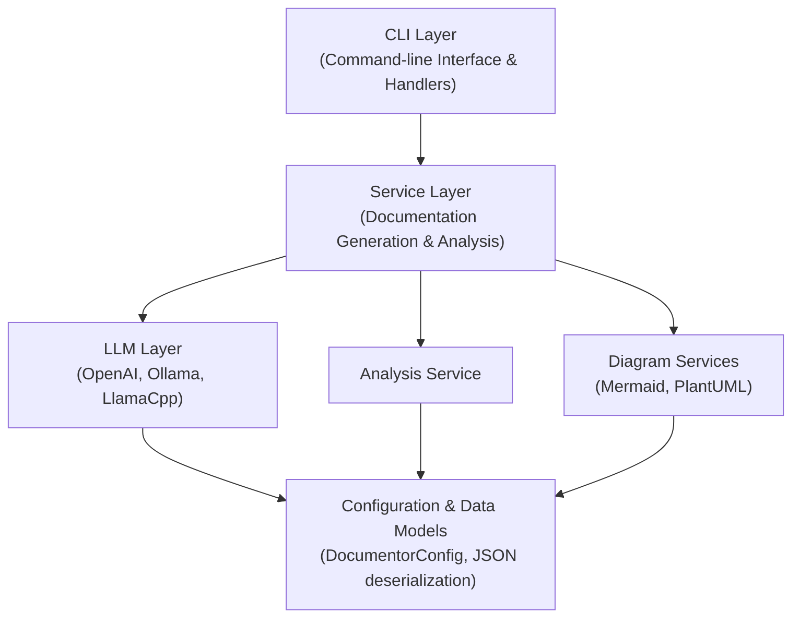
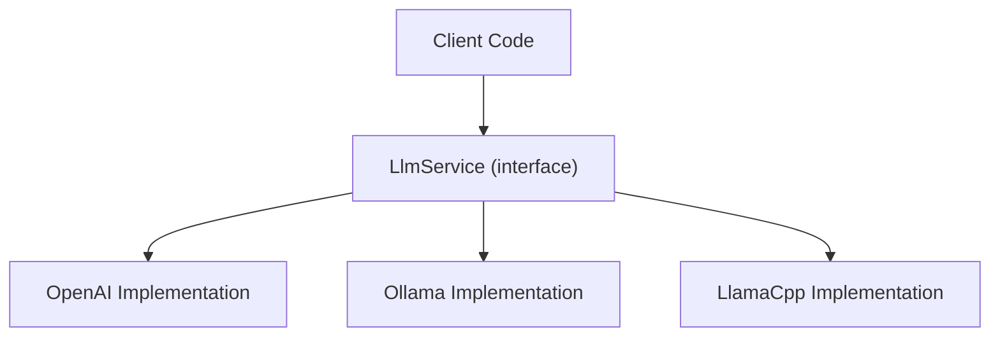
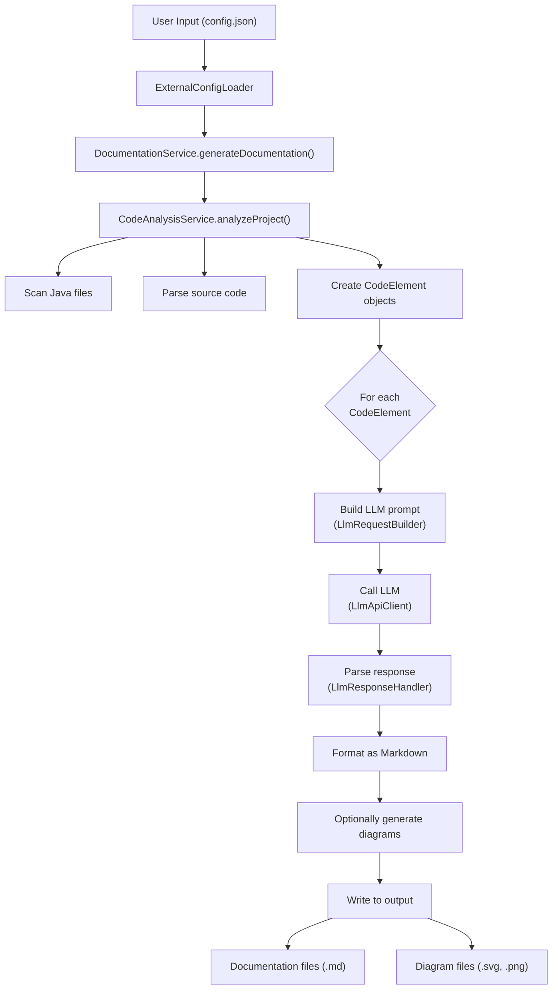
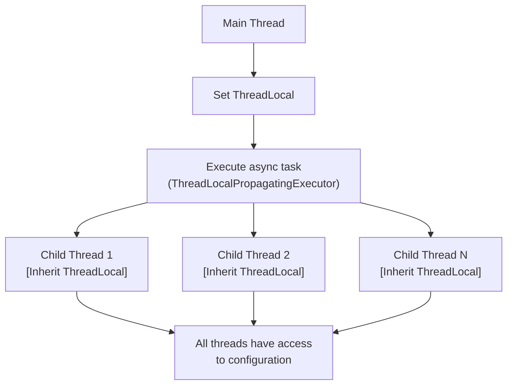
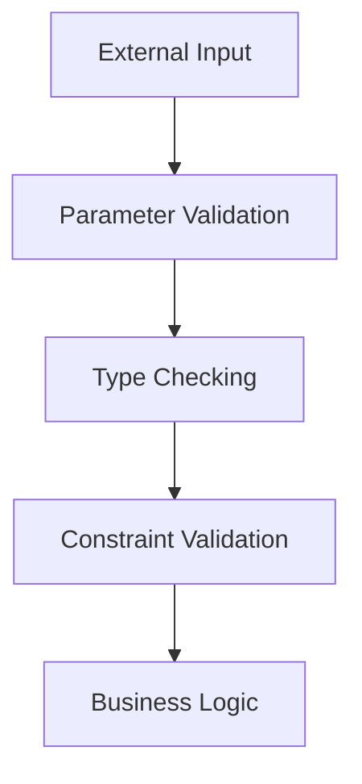
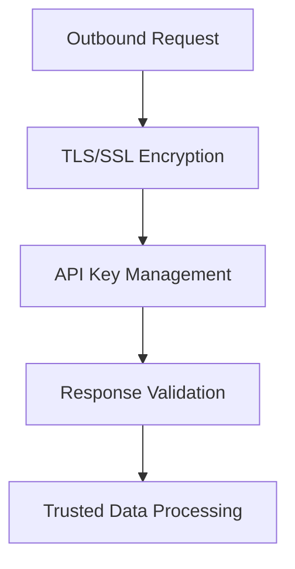
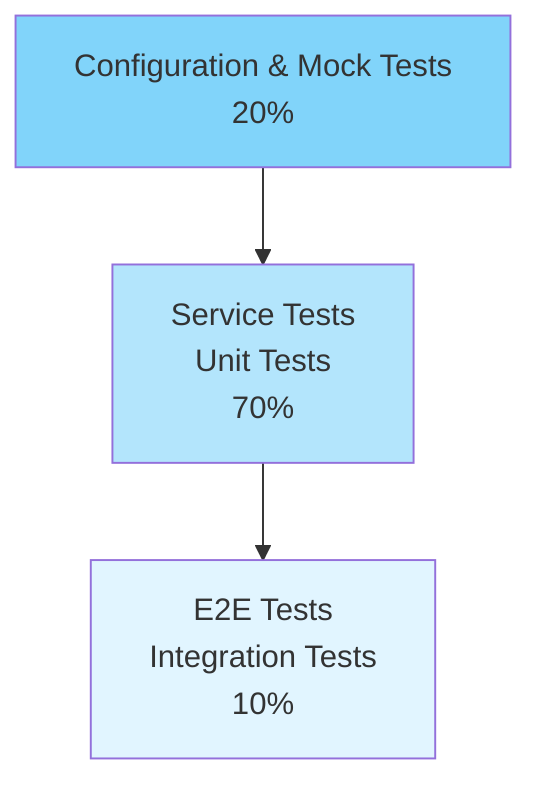

# Architecture Guide - Documentor

## Table of Contents

- [Overview](#overview)
- [System Architecture](#system-architecture)
- [Component Details](#component-details)
- [Data Flow](#data-flow)
- [Design Patterns](#design-patterns)

## Overview

Documentor follows a layered, modular architecture designed for extensibility and testability. The system is built on Spring Boot 3.2 with Java 21, utilizing async processing and thread-safe design patterns.

### High-Level Architecture

## System Architecture

### Layer Structure

#### 1. CLI Layer (`cli/handlers/`)

**Purpose**: Command-line interface and argument parsing

**Components**:

- `ProjectAnalysisCommandHandler` - Main command handler
- `DirectCommandProcessor` - Direct command processing
- Argument parsing and validation

**Responsibilities**:

- Parse command-line arguments
- Route commands to appropriate handlers
- Set up ThreadLocal context for distributed processing

#### 2. Service Layer (`service/`)

**Purpose**: Core business logic and orchestration

**Components**:

- `DocumentationService` - Orchestrates documentation generation
- `DocumentationServiceEnhanced` - Enhanced with threading support
- `LlmService` - LLM abstraction and provider handling
- `ElementDocumentationGenerator` - Individual element documentation

**Responsibilities**:

- Coordinate documentation generation workflow
- Manage async processing
- Handle error recovery and logging

#### 3. LLM Provider Layer (`service/llm/`)

**Purpose**: LLM provider abstraction and integration

**Components**:

- `LlmRequestBuilder` - Constructs prompts for LLMs
- `LlmResponseHandler` - Parses LLM responses
- `LlmApiClient` - HTTP client for provider APIs
- Provider-specific implementations

**Responsibilities**:

- Abstract provider differences
- Handle API communication
- Manage token limits and timeouts
- Implement retry logic

#### 4. Configuration Layer (`config/`)

**Purpose**: Configuration management and bean initialization

**Components**:

- `DocumentorConfig` - Main configuration record
- `LlmServiceConfiguration` - LLM service beans
- `DocumentationServiceConfiguration` - Service beans
- `ExternalConfigLoader` - External JSON configuration

**Responsibilities**:

- Load and validate configuration
- Create and wire Spring beans
- Manage ThreadLocal context
- Handle configuration overrides

#### 5. Data Model Layer (`model/`)

**Purpose**: Data structures and domain models

**Components**:

- `CodeElement` - Represents code elements (class/method/field)
- `DocumentationResult` - Generated documentation
- `LlmModelConfig` - LLM configuration
- Analysis and output settings

## Component Details

### DocumentationService

**Workflow**:

1. Analyze Java files in project
2. Create CodeElement objects
3. For each element:
   - Generate documentation via LLM
   - Format as Markdown
   - Optionally generate diagrams
4. Write files to output directory

**Key Methods**:

- `generateDocumentation()` - Main orchestration
- `analyzeProject()` - Project scanning
- `processElement()` - Individual element processing

### LlmService

**Abstraction Pattern**:

**Key Methods**:

- `generateDocumentation()` - Generate docs for code element
- `generateDescription()` - Generate text description
- `callLlm()` - Raw LLM API call

### Configuration Loading

**Process**:

1. Early configuration loading (BeanFactoryPostProcessor)
2. Parse command-line arguments
3. Load external JSON file
4. Merge with application.yml defaults
5. Validate configuration
6. Create service beans with config

## Data Flow

### Documentation Generation Flow

### ThreadLocal Context Propagation

## Design Patterns

### 1. Strategy Pattern

**Context**: LLM Provider Selection

**Implementation**:

- Interface: `LlmService`
- Strategies: OpenAI, Ollama, LlamaCpp implementations
- Selection: Configuration-driven

**Benefit**: Easy provider switching without code changes

### 2. Builder Pattern

**Context**: Complex Object Construction

**Implementation**:

- `LlmRequestBuilder` - Constructs prompts
- Configuration builders
- Request object construction

**Benefit**: Clear, readable object construction

### 3. ThreadLocal Pattern

**Context**: Configuration Distribution

**Implementation**:

- `ThreadLocalContextHolder`
- `ThreadLocalPropagatingExecutor`
- Config propagation to child threads

**Benefit**: Configuration available in async contexts without passing parameters

### 4. Facade Pattern

**Context**: Service Layer

**Implementation**:

- `DocumentationService` hides complexity
- `LlmService` abstracts provider details
- Single entry point for documentation generation

**Benefit**: Simple client API for complex operations

### 5. Factory Pattern

**Context**: Bean Creation

**Implementation**:

- Spring `@Configuration` classes
- Factory methods for service creation
- Provider selection factory

**Benefit**: Flexible bean creation and lifecycle management

## Key Architectural Decisions

### 1. Async Processing

**Decision**: Use `ExecutorService` with `ThreadLocalPropagatingExecutor`

**Rationale**:

- Improved performance for I/O-bound operations
- Better resource utilization
- Support for concurrent LLM requests

**Trade-off**: Increased complexity for multi-threaded context management

### 2. Configuration-Driven Design

**Decision**: All configuration via external JSON file

**Rationale**:

- No code changes for different environments
- Easy sharing of configurations
- Reduced deployment complexity

**Trade-off**: Must validate configuration thoroughly

### 3. Abstraction of LLM Providers

**Decision**: Single interface supporting multiple providers

**Rationale**:

- User not locked into single provider
- Easy to add new providers
- Testable with mock implementations

**Trade-off**: Abstraction may not capture all provider-specific features

### 4. Spring Boot Framework

**Decision**: Use Spring Boot 3.2 with Java 21 features

**Rationale**:

- Mature, stable framework
- Excellent testing support
- Built-in dependency injection
- Community support

**Trade-off**: Higher memory footprint than minimal solutions

## Security Architecture

### Input Validation

### API Communication

## Testing Architecture

### Test Pyramid

### Testing Strategy

- **Unit Tests**: Individual component testing with mocks
- **Integration Tests**: Full workflow testing with real components
- **Configuration Tests**: Configuration loading and validation
- **Coverage**: Target 80%+ code coverage via JaCoCo

## Extension Points

### Adding a New LLM Provider

1. Create `src/main/java/com/documentor/service/llm/providers/{Provider}Service.java`
2. Implement `LlmService` interface
3. Add configuration in `LlmServiceConfiguration`
4. Add test cases in `src/test/`
5. Update documentation

### Adding a New Diagram Type

1. Create new diagram service class
2. Implement diagram generation logic
3. Add to `DiagramServiceConfiguration`
4. Add test cases
5. Update configuration documentation

### Adding a New Output Format

1. Create formatter class implementing `DocumentationFormatter`
2. Add to output settings
3. Implement formatting logic
4. Add test cases

## Performance Considerations

### Optimization Strategies

1. **Caching**: Cache LLM responses for identical inputs
2. **Async Processing**: Parallel analysis and documentation generation
3. **Batch Processing**: Group LLM requests
4. **Connection Pooling**: Reuse HTTP connections

### Monitoring

- Log key operations and timing
- Track LLM API usage and costs
- Monitor thread pool performance
- Alert on errors and failures

---

**Version**: 2.1.0
**Last Updated**: December 9, 2025
