# 🎨 Class Diagrams Guide

Complete guide to understanding and generating class diagrams with Documentor.

## Diagram Types

Documentor supports two industry-standard diagram formats:

1. **Mermaid** - Modern, Git-friendly, renders in GitHub
2. **PlantUML** - Professional UML standard, advanced features

## Mermaid Class Diagrams

### What is Mermaid?

Mermaid is a JavaScript-based diagramming and charting tool that renders Markdown-inspired text definitions to create diagrams dynamically. Perfect for documentation because it renders directly in GitHub and most markdown viewers.

**Benefits:**

- ✅ Renders in GitHub, GitLab, and most markdown viewers
- ✅ Easy to read text format
- ✅ Version control friendly (small text files)
- ✅ No external rendering required
- ✅ Modern and popular

**Learn more:** [Mermaid Official Documentation](https://mermaid.js.org/)

### Mermaid Class Diagram Syntax

#### Basic Class Definition

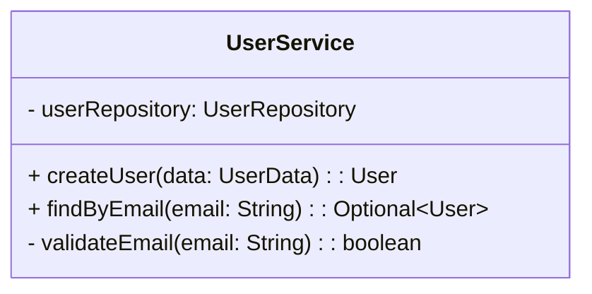

#### Visibility Symbols

| Symbol | Meaning   | Example          |
| ------ | --------- | ---------------- |
| `+`    | Public    | `+method()`      |
| `-`    | Private   | `-field: String` |
| `#`    | Protected | `#method()`      |
| `~`    | Package   | `~method()`      |

#### Class Relationships

**Association (uses)**

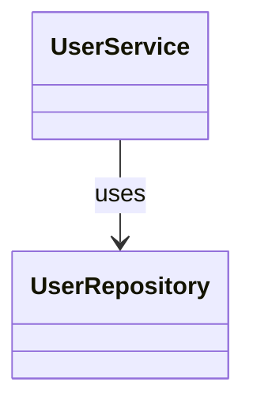

**Inheritance**

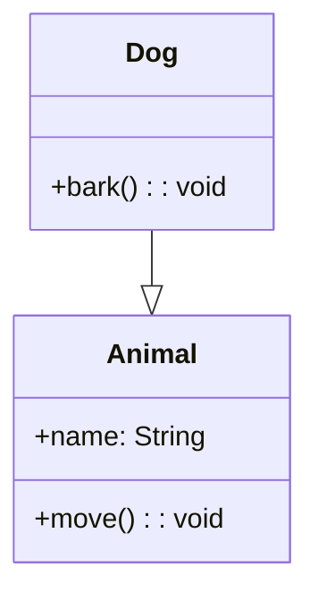

**Composition**

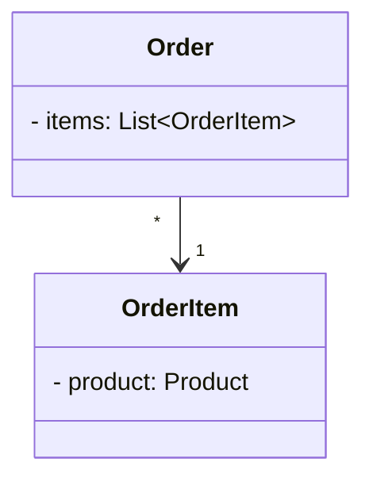

### Generating Mermaid Diagrams

#### Basic Generation

```bash
documentor> analyze --project-path ./src --generate-mermaid true --config config.json
```

#### With Custom Output Directory

```bash
documentor> analyze \
  --project-path ./src \
  --generate-mermaid true \
  --mermaid-output ./diagrams \
  --config config.json
```

### Mermaid Example: E-Commerce System

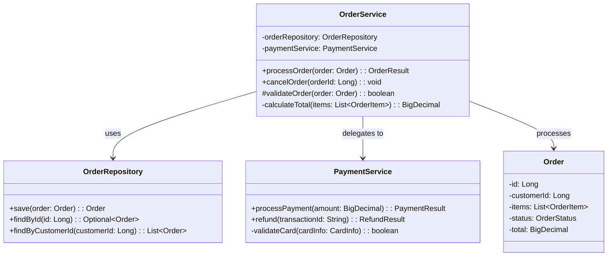

### Viewing Mermaid Diagrams

**Option 1: GitHub**

Simply commit the `.mmd` files to GitHub, and they render automatically.

**Option 2: Online Editor**

Paste your diagram code in [Mermaid Live Editor](https://mermaid.live/)

**Option 3: VS Code**

Install the [Markdown Preview Mermaid Support](https://marketplace.visualstudio.com/items?itemName=bierner.markdown-mermaid) extension

## PlantUML Class Diagrams

### What is PlantUML?

PlantUML is a component that allows you to quickly write UML diagrams using a simple and intuitive language. It follows standard UML notation and is widely used in enterprise environments.

**Benefits:**

- ✅ Industry-standard UML notation
- ✅ Professional appearance
- ✅ Advanced relationship detection
- ✅ Extensive customization options
- ✅ Widely adopted in enterprises

**Learn more:** [PlantUML Official Website](https://plantuml.com/)

### PlantUML Class Diagram Syntax

#### Basic Class Definition

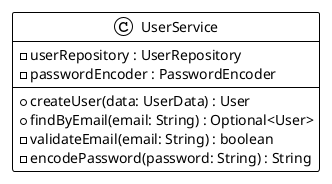

#### Visibility Symbols

| Symbol | Meaning   | Example           |
| ------ | --------- | ----------------- |
| `+`    | Public    | `+ method()`      |
| `-`    | Private   | `- field: String` |
| `#`    | Protected | `# method()`      |
| `~`    | Package   | `~ method()`      |

#### Class Relationships

**Dependency/Association**

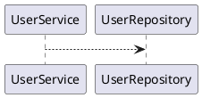

**Inheritance**

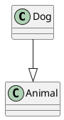

**Implementation**

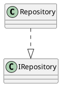

### Generating PlantUML Diagrams

#### Basic Generation

```bash
documentor> analyze --project-path ./src --generate-plantuml true --config config.json
```

#### With Custom Output Directory

```bash
documentor> analyze \
  --project-path ./src \
  --generate-plantuml true \
  --plantuml-output ./uml-diagrams \
  --config config.json
```

### PlantUML Example: E-Commerce System

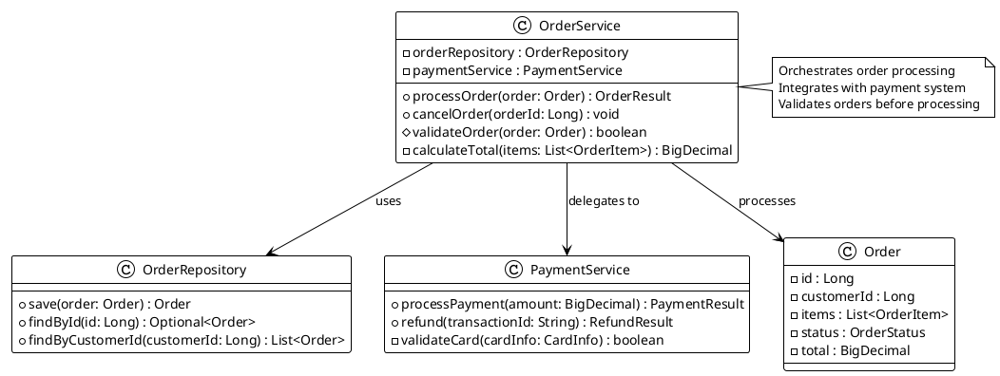

### Viewing PlantUML Diagrams

**Option 1: PlantUML Online Server**

Use the [PlantUML Online Server](http://www.plantuml.com/plantuml/uml/) to view diagrams:

1. Copy your `.puml` file content
2. Paste into the online editor
3. View rendered diagram

**Option 2: VS Code Extension**

Install [PlantUML](https://marketplace.visualstudio.com/items?itemName=jebbs.plantuml) extension

Then preview with `Alt+D` on `.puml` files

**Option 3: Command Line Tool**

```bash
# Install PlantUML
java -jar plantuml.jar diagram.puml

# Generates diagram.png
```

## Comparison: Mermaid vs PlantUML

| Feature            | Mermaid     | PlantUML      |
| ------------------ | ----------- | ------------- |
| **Git Rendering**  | ✅ Yes      | ❌ No         |
| **GitHub Preview** | ✅ Yes      | ❌ No         |
| **UML Standard**   | ⚠️ Partial  | ✅ Full       |
| **Ease of Use**    | ✅ Easy     | ⚠️ Moderate   |
| **Customization**  | ⚠️ Basic    | ✅ Advanced   |
| **Learning Curve** | ✅ Low      | ⚠️ Medium     |
| **Professional**   | ⚠️ Modern   | ✅ Enterprise |
| **Online Viewer**  | ✅ Built-in | ✅ Available  |

## Diagram Generation Examples

### Example 1: Generate Both Diagram Types

```bash
documentor> analyze \
  --project-path ./src \
  --generate-mermaid true \
  --generate-plantuml true \
  --mermaid-output ./diagrams/mermaid \
  --plantuml-output ./diagrams/plantuml \
  --config config.json
```

### Example 2: Public API Diagrams (Without Private Members)

```bash
documentor> analyze \
  --project-path ./src \
  --include-private-members false \
  --generate-mermaid true \
  --config config.json
```

**Result:**

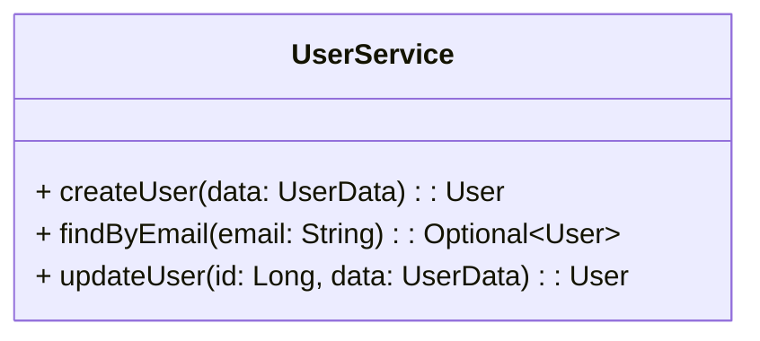

### Example 3: Complete Implementation Diagrams (With Private Members)

```bash
documentor> analyze \
  --project-path ./src \
  --include-private-members true \
  --generate-plantuml true \
  --config config.json
```

**Result:**

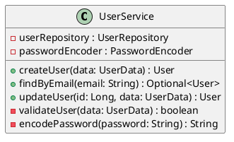

### Example 4: Diagrams Only (Fast Processing)

```bash
documentor> analyze --project-path ./src --config samples/config-diagrams-only.json
```

## File Naming Customization

Customize how diagram files are named with configurable prefixes, suffixes, and extensions. This feature improves organization, versioning, and integration with external tools.

### Overview

File naming options allow you to:
- **Prefix**: Add project/team identifiers (e.g., `2025-API-`, `arch-`)
- **Suffix**: Add version/status markers (e.g., `_v2`, `_final`)
- **Extension**: Use custom file extensions (e.g., `uml`, `md`, `puml`)

### Configuration

Configure naming in `config.json` under `output_settings`:

```json
{
  "output_settings": {
    "output_directory": "./docs",
    "generate_mermaid": true,
    "generate_plantuml": true,
    "mermaid_naming": {
      "prefix": "arch-",
      "suffix": "",
      "extension": "md"
    },
    "plantuml_naming": {
      "prefix": "2025-API-",
      "suffix": "_v2",
      "extension": "uml"
    },
    "error_log": "errors.log",
    "output_log": "out.log"
  }
}
```

### Naming Rules

**Allowed Characters:** `[0-9a-zA-Z- ()+._]`

**Length Limits:**
- Prefix/Suffix: Maximum 20 characters
- Extension: Maximum 10 characters

**Validation:**
- Invalid prefixes/suffixes are ignored (operation continues)
- Invalid extensions default to `mmd` (Mermaid) or `plantuml` (PlantUML)
- All errors logged to `error_log` path

### Examples

**Example 1: Version-Tagged Diagrams**

```json
{
  "plantuml_naming": {
    "prefix": "v2.0-",
    "suffix": "_draft",
    "extension": "puml"
  }
}
```

Generated file: `v2.0-UserService_draft.puml`

**Example 2: Team Prefixes**

```json
{
  "mermaid_naming": {
    "prefix": "backend-",
    "suffix": "",
    "extension": "mmd"
  }
}
```

Generated file: `backend-OrderService.mmd`

**Example 3: Markdown Extension**

```json
{
  "mermaid_naming": {
    "prefix": "",
    "suffix": "",
    "extension": "md"
  }
}
```

Generated file: `PaymentService.md`

### Use Cases

**1. Project Organization**
```
2025-API-UserService_v2.uml
2025-API-OrderService_v2.uml
2025-API-PaymentService_v2.uml
```

**2. Architecture Documentation**
```
arch-DataFlow.md
arch-SecurityModel.md
arch-Deployment.md
```

**3. Legacy Compatibility**
```
legacy-CustomerMgmt_old.puml
```

### Backward Compatibility

When no naming options are configured:
- Mermaid diagrams: `ClassName_diagram.mmd`
- PlantUML diagrams: `ClassName_plantuml.puml`

This maintains compatibility with existing workflows.

## Best Practices

### Choosing the Right Diagram Type

**Use Mermaid when:**

- Documenting in GitHub/GitLab
- Want diagrams in markdown files
- Prefer simplicity and readability
- Target audience is developers

**Use PlantUML when:**

- Need professional UML notation
- Creating enterprise architecture docs
- Requires advanced relationship mapping
- Sharing with non-technical stakeholders

### Effective Diagram Usage

- ✅ **Show relationships** between classes
- ✅ **Highlight key methods** and properties
- ✅ **Use private members** for internal documentation
- ✅ **Omit private members** for public API documentation
- ✅ **Add notes** to explain complex relationships
- ❌ Avoid cluttering diagrams with every detail
- ❌ Don't include test classes
- ❌ Don't mix different levels of abstraction

### Organizing Diagrams

Create a structured folder layout:

```text
diagrams/
├── mermaid/
│   ├── core/
│   │   ├── UserService.mmd
│   │   └── OrderService.mmd
│   └── integration/
│       ├── PaymentIntegration.mmd
│       └── NotificationService.mmd
└── plantuml/
    ├── core/
    │   ├── UserService.puml
    │   └── OrderService.puml
    └── integration/
        ├── PaymentIntegration.puml
        └── NotificationService.puml
```

## Advanced Features

### Mermaid Advanced

#### Multiple Classes

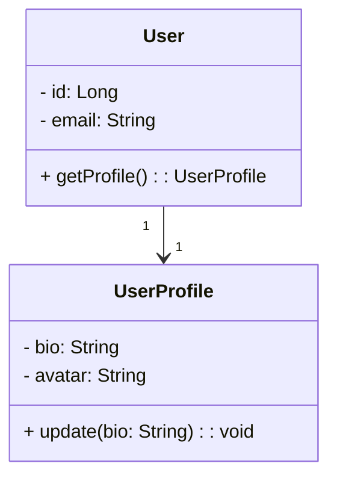

#### Abstract Classes

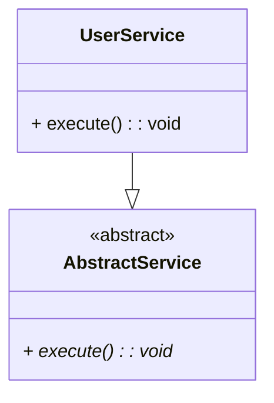

### PlantUML Advanced

#### Themes

```plantuml
@startuml
!theme materia-outline
@enduml
```

Available themes:

- `plain` (default)
- `materia-outline`
- `archimate`
- `cerulean`
- `amiga`

#### Stereotypes

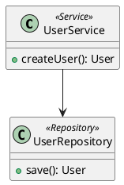

## Troubleshooting

### Mermaid Diagram Not Rendering in GitHub

**Solution:**

1. Ensure file has `.mmd` extension
2. Check file is in main branch
3. Verify markdown syntax is correct
4. Try in [Mermaid Live Editor](https://mermaid.live/)

### PlantUML Too Large or Complex

**Solution:**

1. Split into multiple diagrams
2. Use package grouping
3. Filter with `--include-private-members false`
4. Create separate diagrams for subsystems

### Performance Issues Generating Diagrams

**Solution:**

1. Generate diagrams only: use `config-diagrams-only.json`
2. Reduce `max_tokens` in configuration
3. Use smaller models (phi3:mini, llama3.2)
4. Process fewer files at a time

## Integration with Documentation

### Embedding in Markdown

**Mermaid:**

````markdown
## UserService Architecture

```mermaid
classDiagram
    ...
```
````

**PlantUML** (with image):

```markdown
## UserService Architecture


```

### Creating Diagram Gallery

Create `docs/DIAGRAMS.md`:

```markdown
# Architecture Diagrams

## Core Services

### UserService


### OrderService


```

## Next Steps

- **[Usage Examples](USAGE_EXAMPLES.md)** - Command examples and workflows
- **[Configuration Guide](CONFIGURATION.md)** - Diagram-specific settings
- **[Mermaid Documentation](https://mermaid.js.org/)** - Learn more about Mermaid
- **[PlantUML Documentation](https://plantuml.com/)** - Learn more about PlantUML
