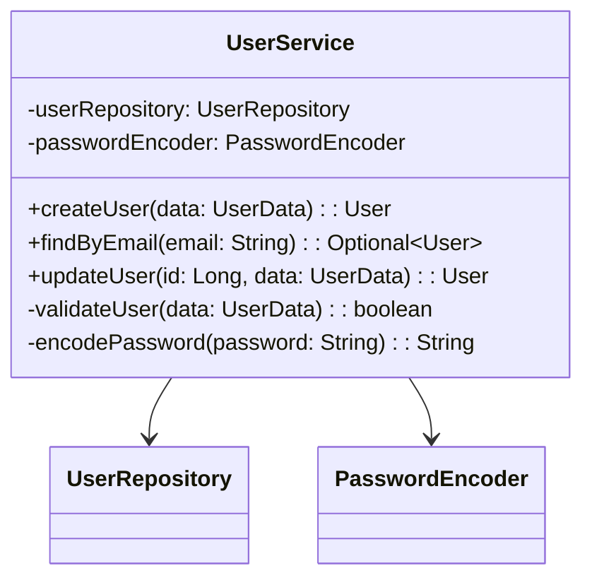
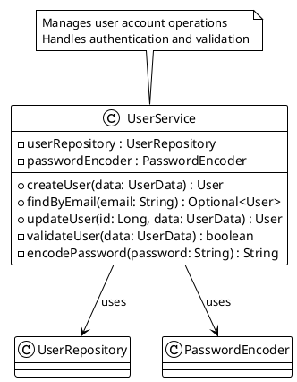

# 📖 Usage Examples & Commands

Comprehensive guide with practical examples for all Documentor commands.

## Interactive Shell

### Starting the Shell

```bash
./gradlew runApp
```

You'll see the Documentor prompt:

```
documentor>
```

### Basic Commands

#### Help Commands

```bash
# Show main help
help

# Show quick start guide
quick-start

# Show application info
info
```

## Analysis Commands

### Basic Analysis

```bash
documentor> analyze --project-path /path/to/project --config config.json
```

**Output:**

```text
🚀 Starting analysis of project: /path/to/project
✅ Analysis complete! Documentation generated at: ./docs
📊 Analysis Summary: 125 total elements (15 classes, 89 methods, 21 fields) across 12 files
```

### Analysis with Mermaid Diagrams

```bash
documentor> analyze --project-path ./src --generate-mermaid true --config config.json
```

**Output:**

```text
✅ Analysis complete! Documentation generated at: ./docs
📊 Generated 5 Mermaid diagrams
🎨 Diagram files:
  - ./src/UserService_diagram.mmd
  - ./src/ProductController_diagram.mmd
  - ./src/DatabaseConfig_diagram.mmd
```

### Analysis with Custom Diagram Output

```bash
documentor> analyze \
  --project-path ./src \
  --generate-mermaid true \
  --mermaid-output ./my-diagrams \
  --config config.json
```

### Analysis with PlantUML Diagrams

```bash
documentor> analyze --project-path ./src --generate-plantuml true --config config.json
```

### Analysis with Both Diagram Types

```bash
documentor> analyze \
  --project-path ./src \
  --generate-mermaid true \
  --generate-plantuml true \
  --mermaid-output ./diagrams/mermaid \
  --plantuml-output ./diagrams/plantuml \
  --config config.json
```

### Analysis Without Private Members

```bash
documentor> analyze \
  --project-path ./src \
  --include-private-members false \
  --config config.json
```

### Analysis With Private Members

```bash
documentor> analyze \
  --project-path ./src \
  --include-private-members true \
  --generate-plantuml true \
  --config config.json
```

## Scan Commands

### Project Scan (Analysis Only)

Scan without generating documentation:

```bash
documentor> scan --project-path ./src
```

**Output:**

```text
📊 Project Analysis Results
━━━━━━━━━━━━━━━━━━━━━━━━━━
📊 Analysis Summary: 67 total elements (8 classes, 45 methods, 14 fields) across 6 files

📁 Files analyzed:
  - ./src/main.py
  - ./src/utils.py
  - ./src/models/user.py
```

### Scan with Specific Language

```bash
documentor> scan --project-path ./src --supported-languages java
```

## Configuration Commands

### Validate Configuration

```bash
documentor> validate-config --config config.json
```

**Output:**

```text
✅ Configuration file is valid: config.json
Size: 1024 bytes
Models configured: 2
- gpt-3.5-turbo
- codellama
```

### Validate with Detailed Output

```bash
documentor> validate-config --config config.json
```

## Status Command

### Check Application Status

```bash
documentor> status
```

**Output:**

```text
📋 Documentor Status
━━━━━━━━━━━━━━━━━━━━━━━━━━

📁 Current Project:
   Path: /path/to/my-spring-project
   Exists: ✅ Yes
   Type: Directory

⚙️ Configuration:
   Config File: config.json
   Config Exists: ✅ Yes

🤖 LLM Models:
   Total Models: 2
   1. gpt-3.5-turbo
      API Key: ***...
      Max Tokens: 4096
      Endpoint: https://api.openai.com/v1/chat/completions
   2. codellama
      Max Tokens: 4096
      Endpoint: http://localhost:11434/api/generate

📤 Output Settings:
   Output Path: ./docs
   Format: markdown
   Include Icons: ✅ Yes
   Generate Unit Tests: ✅ Yes
   Generate Mermaid: ✅ Yes
   Generate PlantUML: ✅ No
   Target Coverage: 90.0%

📊 Analysis Settings:
   Include Private Members: ❌ No
   Max Threads: 4
   Supported Languages: java, python
   Exclude Patterns: **/test/**, **/target/**, **/build/**
```

## Practical Examples by Use Case

### Example 1: Quick Project Overview with Diagrams

```bash
documentor> analyze \
  --project-path ./my-java-project \
  --generate-mermaid true \
  --config samples/config-ollama.json
```

### Example 2: Complete Documentation with All Details

```bash
documentor> analyze \
  --project-path ./src \
  --include-private-members true \
  --generate-mermaid true \
  --generate-plantuml true \
  --config samples/config-openai.json
```

### Example 3: Diagrams Only (Fast Processing)

```bash
documentor> analyze \
  --project-path ./src \
  --config samples/config-diagrams-only.json
```

### Example 4: Documentation Only (Detailed Text)

```bash
documentor> analyze \
  --project-path ./src \
  --config samples/config-docs-only.json
```

### Example 5: Multiple Projects in Sequence

```bash
# First project
documentor> analyze --project-path ./project-a --config config.json

# Second project
documentor> analyze --project-path ./project-b --config config.json

# Third project
documentor> analyze --project-path ./project-c --config config.json
```

### Example 6: Generate Test Logs Without Running Tests

```bash
documentor> analyze \
  --project-path ./src \
  --generate-unit-tests true \
  --run-unit-test-commands false \
  --log-unit-test-commands true \
  --config config.json
```

### Example 7: Python Project Analysis

```bash
documentor> analyze \
  --project-path ./python-app \
  --supported-languages python \
  --generate-mermaid true \
  --config config.json
```

### Example 8: Large Project with Custom Thread Pool

```bash
documentor> analyze \
  --project-path ./large-enterprise-project \
  --max-threads 8 \
  --config config.json
```

## Non-Interactive Mode

Run commands directly from the terminal without interactive shell:

### Direct Analysis

```bash
./gradlew runApp -Pargs="analyze,--project-path,./src,--config,config.json"
```

### Direct Scan

```bash
./gradlew runApp -Pargs="scan,--project-path,./src"
```

### Direct Configuration Validation

```bash
./gradlew runApp -Pargs="validate-config,--config,config.json"
```

### Direct Status Check

```bash
./gradlew runApp -Pargs="status"
```

## Output Examples

### Generated Documentation Structure

After running `analyze`, you'll find:

```text
docs/
├── README.md                 # Main documentation
├── elements/                 # Individual element docs
│   ├── UserService.md
│   ├── ProductController.md
│   └── OrderService.md
└── unit-tests/              # Generated test suggestions
    └── test-recommendations.md
```

### Generated Mermaid Diagram Example



### Generated PlantUML Diagram Example



## Command Reference

### analyze

Generate documentation and diagrams for a project.

**Syntax:**

```bash
analyze --project-path <path> [options]
```

**Options:**

| Option                      | Type    | Default     | Description                    |
| --------------------------- | ------- | ----------- | ------------------------------ |
| `--project-path`            | String  | (req)       | Path to project directory      |
| `--config`                  | String  | config.json | Configuration file path        |
| `--include-private-members` | Boolean | false       | Include private fields/methods |
| `--generate-mermaid`        | Boolean | false       | Generate Mermaid diagrams      |
| `--mermaid-output`          | String  | (auto)      | Output directory for Mermaid   |
| `--generate-plantuml`       | Boolean | false       | Generate PlantUML diagrams     |
| `--plantuml-output`         | String  | (auto)      | Output directory for PlantUML  |

### scan

Analyze project without generating documentation.

**Syntax:**

```bash
scan --project-path <path> [options]
```

**Options:**

| Option           | Type   | Default     | Description               |
| ---------------- | ------ | ----------- | ------------------------- |
| `--project-path` | String | (req)       | Path to project directory |
| `--config`       | String | config.json | Configuration file path   |

### validate-config

Validate a configuration file.

**Syntax:**

```bash
validate-config --config <file>
```

**Options:**

| Option     | Type   | Default | Description             |
| ---------- | ------ | ------- | ----------------------- |
| `--config` | String | (req)   | Configuration file path |

### status

Display application status.

**Syntax:**

```bash
status
```

## Tips & Tricks

### Running Multiple Analyses

```bash
# Each analysis can have different settings
documentor> analyze --project-path ./backend --config config-openai.json
documentor> analyze --project-path ./frontend --config config-ollama.json
documentor> analyze --project-path ./shared --config config-diagrams-only.json
```

### Generating Diagrams for Different Audiences

```bash
# Detailed diagrams with private members for developers
analyze --project-path ./src --include-private-members true --generate-plantuml true

# Simplified diagrams with public API for clients
analyze --project-path ./src --include-private-members false --generate-mermaid true
```

### Testing Configuration Before Full Analysis

```bash
# Validate config first
validate-config --config config.json

# Quick scan to verify setup
scan --project-path ./src

# Then run full analysis
analyze --project-path ./src --config config.json
```

### Performance Optimization

```bash
# Diagrams only (faster)
analyze --project-path ./src --generate-mermaid true --config config-diagrams-only.json

# Documentation only (comprehensive)
analyze --project-path ./src --config config-docs-only.json
```

## Next Steps

- **[Configuration Guide](CONFIGURATION.md)** - Detailed configuration options
- **[LLM Integrations](LLM_INTEGRATIONS.md)** - Setup for each LLM provider
- **[Diagrams Guide](DIAGRAMS_GUIDE.md)** - Understanding diagram generation
