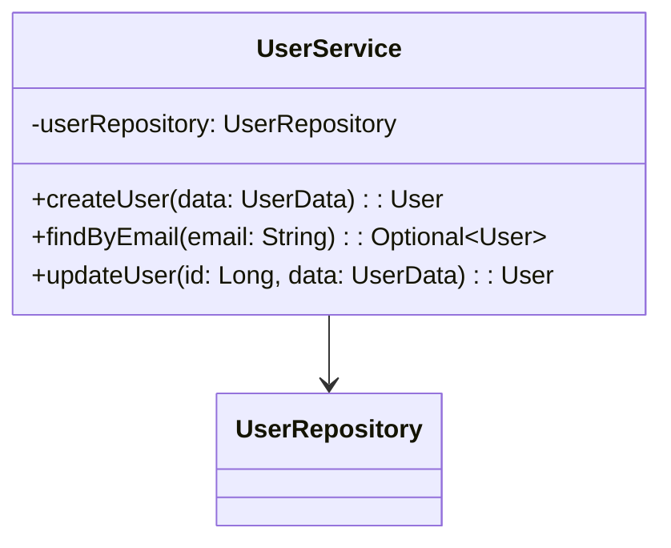

# 📖 Usage Examples & Commands

Practical examples for all Documentor commands and features.

## Table of Contents

- [Interactive Shell](#interactive-shell)
- [Basic Commands](#basic-commands)
- [Analysis with Diagrams](#analysis-with-diagrams)
- [Dry-Run Mode](#dry-run-mode)
- [Output Management](#output-management)
- [Non-Interactive Mode](#non-interactive-mode)
- [Examples by Use Case](#examples-by-use-case)
- [Command Reference](#command-reference)

## Interactive Shell

### Starting

```bash
./gradlew runApp
```

You'll see the prompt:

```
documentor>
```

### Help Commands

```bash
help
quick-start
info
```

## Basic Commands

### Analyze Project

```bash
documentor> analyze --project-path ./src --config config.json
```

Output:

```text
🚀 Starting analysis of project: ./src
✅ Analysis complete! Documentation generated at: ./docs
📊 Analysis Summary: 125 total elements (15 classes, 89 methods, 21 fields) across 12 files
```

### Scan Project (Analysis Only)

```bash
documentor> scan --project-path ./src
```

### Validate Configuration

```bash
documentor> validate-config --config config.json
```

Output:

```text
✅ Configuration file is valid: config.json
Size: 1024 bytes
Models configured: 2
- gpt-3.5-turbo
- codellama
```

### Check Status

```bash
documentor> status
```

Shows application configuration and capabilities.

## Analysis with Diagrams

### Mermaid Only

```bash
documentor> analyze \
  --project-path ./src \
  --generate-mermaid true \
  --config config.json
```

### PlantUML Only

```bash
documentor> analyze \
  --project-path ./src \
  --generate-plantuml true \
  --config config.json
```

### Both Diagram Types

```bash
documentor> analyze \
  --project-path ./src \
  --generate-mermaid true \
  --generate-plantuml true \
  --mermaid-output ./diagrams/mermaid \
  --plantuml-output ./diagrams/plantuml \
  --config config.json
```

### With Custom Naming

```bash
documentor> analyze \
  --project-path ./src \
  --generate-mermaid true \
  --config samples/config-diagram-naming-example.json
```

### Including Private Members

```bash
documentor> analyze \
  --project-path ./src \
  --include-private-members true \
  --generate-plantuml true \
  --config config.json
```

## Dry-Run Mode

### Preview Without Writing Files

```bash
documentor> analyze \
  --project-path ./src \
  --config config.json \
  --dry-run true
```

Output:

```text
📋 DRY RUN: Analysis would generate documentation at: ./docs
📋 DRY RUN: Would create 12 documentation files
📋 DRY RUN: Would create 5 Mermaid diagrams
📋 DRY RUN: Would create 3 PlantUML diagrams
📋 DRY RUN: No files were actually written
```

### Use Cases

- **Validate** configuration before actual generation
- **Preview** output structure without side effects
- **Test** in CI/CD pipelines safely
- **Troubleshoot** issues without creating files
- **Verify** analysis completes without errors

## Output Management

### Collision Strategies

**Safe Mode (Never Overwrite)**

```bash
documentor> analyze \
  --project-path ./src \
  --config samples/config-ollama.json
```

Uses timestamp strategy: `MyClass_diagram_20251121_143022.mmd`

**Versioning Mode**

```bash
documentor> analyze \
  --project-path ./src \
  --config samples/config-collision-strategies.json
```

Uses increment strategy: `MyClass_diagram_v1.mmd`, `MyClass_diagram_v2.mmd`

**Strict Mode (Fail on Collision)**

```bash
documentor> analyze \
  --project-path ./src \
  --config samples/config-collision-strategies.json
```

For CI/CD - fails if files exist.

## Non-Interactive Mode

Run commands directly without shell:

### Direct Analysis

```bash
./gradlew runApp -Pargs="analyze,--project-path,./src,--config,config.json"
```

### Direct Scan

```bash
./gradlew runApp -Pargs="scan,--project-path,./src"
```

### Direct Validation

```bash
./gradlew runApp -Pargs="validate-config,--config,config.json"
```

### Direct Status

```bash
./gradlew runApp -Pargs="status"
```

## Examples by Use Case

### Quick Start with Ollama

```bash
documentor> analyze \
  --project-path ./my-java-project \
  --generate-mermaid true \
  --config samples/config-ollama.json
```

### Production with OpenAI

```bash
documentor> analyze \
  --project-path ./src \
  --include-private-members true \
  --generate-mermaid true \
  --generate-plantuml true \
  --config samples/config-openai.json
```

### Fast Diagram Generation

```bash
documentor> analyze \
  --project-path ./src \
  --config samples/config-diagrams-only.json
```

### Detailed Documentation

```bash
documentor> analyze \
  --project-path ./src \
  --config samples/config-docs-only.json
```

### Unit Test Focus

```bash
documentor> analyze \
  --project-path ./src \
  --generate-unit-tests true \
  --run-unit-test-commands false \
  --log-unit-test-commands true \
  --config samples/config-unit-test-logging.json
```

### Python Project

```bash
documentor> analyze \
  --project-path ./python-app \
  --supported-languages python \
  --generate-mermaid true \
  --config config.json
```

### Large Project with Threads

```bash
documentor> analyze \
  --project-path ./large-project \
  --max-threads 8 \
  --config config.json
```

### Pre-Flight Check

```bash
# 1. Validate config
documentor> validate-config --config config.json

# 2. Scan project
documentor> scan --project-path ./src

# 3. Dry-run analysis
documentor> analyze --project-path ./src --config config.json --dry-run true

# 4. Full analysis
documentor> analyze --project-path ./src --config config.json
```

## Command Reference

### analyze

Generate documentation and diagrams.

**Syntax**: `analyze --project-path <path> [options]`

**Key Options**:

| Option                      | Type    | Default     | Description             |
| --------------------------- | ------- | ----------- | ----------------------- |
| `--project-path`            | String  | Required    | Project directory       |
| `--config`                  | String  | config.json | Config file             |
| `--include-private-members` | Boolean | false       | Include private members |
| `--generate-mermaid`        | Boolean | false       | Generate Mermaid        |
| `--generate-plantuml`       | Boolean | false       | Generate PlantUML       |
| `--dry-run`                 | Boolean | false       | Preview without writing |

### scan

Analyze project without documentation.

**Syntax**: `scan --project-path <path> [options]`

### validate-config

Validate configuration file.

**Syntax**: `validate-config --config <file>`

### status

Display application status.

**Syntax**: `status`

## Output Examples

### Directory Structure

After running `analyze`:

```text
docs/
├── README.md
├── elements/
│   ├── UserService.md
│   ├── ProductController.md
│   └── OrderService.md
└── unit-tests/
    └── test-recommendations.md
```

### Generated Diagram (Mermaid)



## Tips & Tricks

### Chain Multiple Analyses

```bash
documentor> analyze --project-path ./backend --config config-openai.json
documentor> analyze --project-path ./frontend --config config-ollama.json
documentor> analyze --project-path ./shared --config config-diagrams-only.json
```

### Different Audiences

```bash
# Detailed for developers
analyze --project-path ./src --include-private-members true --generate-plantuml true

# Simplified for clients
analyze --project-path ./src --include-private-members false --generate-mermaid true
```

### Performance Optimization

```bash
# Diagrams only (fast)
analyze --project-path ./src --config samples/config-diagrams-only.json

# Documentation only (comprehensive)
analyze --project-path ./src --config samples/config-docs-only.json
```

## Next Steps

- **[Configuration Guide](CONFIGURATION.md)** - Configuration options
- **[LLM Integrations](LLM_INTEGRATIONS.md)** - Provider setup
- **[Diagrams Guide](DIAGRAMS_GUIDE.md)** - Diagram details
